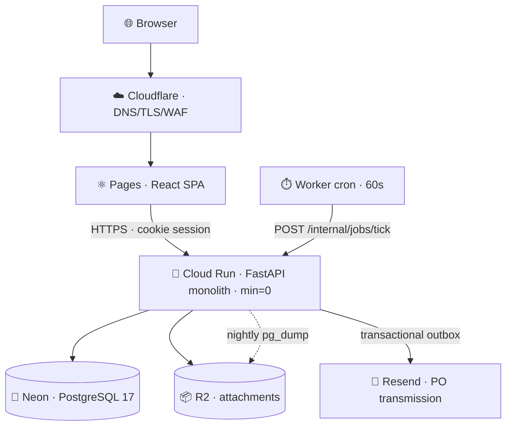

<div align="center">


# ⚡ XLR8 FLO

### Capital projects, budget tracking, and capital expenditure management

*One traceable system of record — from the first plan to the finished asset.*

<br>

[](docs/claude-plan.md#4--delivery-phases)
[](agents/roadmap.yaml)
[](#-cost)

[](docs/claude-plan.md#25-application-structure)
[](docs/claude-plan.md#25-application-structure)
[](docs/claude-plan.md#28-frontend)
[](docs/claude-plan.md#28-frontend)
[](#-the-rules-that-never-bend)
[](design-system/MASTER.md)
[](design-system/MASTER.md)
[](docs/claude-plan.md)

<br>

📐 [Architecture](docs/claude-plan.md) &nbsp;·&nbsp; 📋 [Requirements](docs/requirements.md) &nbsp;·&nbsp; 🎨 [Design system](design-system/MASTER.md) &nbsp;·&nbsp; 🤖 [Agent rules](AGENTS.md) &nbsp;·&nbsp; 🗺️ [Roadmap](agents/roadmap.yaml)

</div>

<div align="center">

<!-- 📸 screenshot: the project dashboard, light + dark side by side -->
<!--  -->

</div>

---

## 🎯 The problem

Organizations run capital expenditure on disconnected Excel workbooks and email threads.

> **Nobody can answer *"what is actually left on this project?"*** without a half-day reconciliation.
> **Nobody can prove *why* a number is what it is.**

XLR8 FLO makes that question instant and auditable. Every balance derives from an append-only ledger. Every ledger entry links to the document and the approval that caused it. Every document keeps a snapshot of what was true when it was sent.

<table>
<tr>
<td width="33%" align="center">🧾<br><b>Request</b><br><sub>Requisition, justified<br>and costed</sub></td>
<td width="33%" align="center">✅<br><b>Authorize</b><br><sub>Conditional workflow,<br>budget reserved</sub></td>
<td width="33%" align="center">📣<br><b>Source</b><br><sub>RFQ, bids compared,<br>award justified</sub></td>
</tr>
<tr>
<td align="center">🛒<br><b>Commit</b><br><sub>PO issued, funds<br>committed atomically</sub></td>
<td align="center">💰<br><b>Expense</b><br><sub>Actuals posted<br>against commitment</sub></td>
<td align="center">🏷️<br><b>Capitalize</b><br><sub>Asset registered with<br>lineage to purchase</sub></td>
</tr>
</table>

> [!NOTE]
> **North Star — *Neutral chrome, chromatic data.***
> The interface is quiet grayscale. Colour appears only where it carries meaning: status, money direction, lifecycle phase, and risk.

---

## ✨ Feature set

<table>
<tr><td width="50%" valign="top">

### 🏗️ Capital projects
Five-level hierarchy with **roll-down funding or roll-up aggregation**, set per business unit. Lifecycle state machine, phases, milestones, risks with likelihood/impact/mitigation, health and percent-complete. Drill from an executive dashboard to a single ledger entry.

### 💰 Budget ledger
Allocate → reserve → commit → expense, plus release, reverse, adjust and transfer. Balances are maintained **in the same transaction** as the ledger write, and reconciled nightly by a job that *reports* drift and never silently corrects it. Atomic cross-hierarchy transfers flow up the source ancestry and down the target's under one transfer id.

### 🧾 Capital requisitions
Project-linked or standalone. Item and service lines with catalogue type-ahead scoped to your business unit. Approval reserves budget **and** generates the sub-project atomically. Split sourcing and partial awards, with requested / sourced / awarded / ordered / remaining tracked per line.

### ✅ Approvals
Visual drag-and-drop workflow builder **and** a keyboard editor with identical capability — same story, not a follow-up. Conditions on any attribute including amount. Any-one / all / quorum groups, membership snapshotted at task creation. Versioned: editing a workflow never disturbs documents already in flight.

</td><td width="50%" valign="top">

### 📣 Sourcing & RFQs
RFQs built from approved requisition lines with an open-quantity guard. Bids capture tax, freight, lead time and validity. A comparison dashboard normalizes cost across currencies **without ever mutating a vendor's original bid**. Split awards by line or quantity; non-lowest awards require justification.

### 🛒 Purchase orders
Issue converts reservation → commitment atomically. Issued POs are **immutable** — changes create numbered, re-approved change orders preserving the exact version the vendor received. PDFs reproducible from the stored snapshot. Transmission through a transactional outbox: retries never send twice, failures are visible and actionable.

### 🤝 Vendors & assets
Vendor profiles with typed contacts, expiring documents, onboarding questionnaires and weighted scoring. **Field-level masking** on tax and banking data. Warehouses with append-only stock movements, FIFO assignment, weighted-average valuation, and a fixed-asset register with lineage back to the originating purchase.

### 📊 Reporting & extensibility
Governed KPI definitions, saved and shared views, HTML/PDF/Excel export that reconciles to the dashboard under identical filters. Custom fields without a deployment. **Label groups** that become group-by axes, filter facets and export columns automatically.

</td></tr>
</table>

<!-- 📸 screenshot: budget waterfall + requisition grid -->

### 🏷️ Status vs. tags — the distinction the UI rests on

Two affordances that look similar and obey **opposite** rules. Conflating them is how a strict status vocabulary decays into decoration.

| | 🔒 **Status** | 🏷️ **Tag** |
|---|---|---|
| **Vocabulary** | Closed, per document type, in code | Open, tenant-defined |
| **Colour** | Derived from meaning — 5 tones, never authored | 14 pre-verified swatches, **never** free-form hex |
| **Shape** | Square-ish, filled tint, **icon mandatory** | Pill, hairline outline, **dot — never an icon** |
| **Answers** | *What state is this in?* | *How do we classify and report on this?* |
| **Example** | ✅ `Approved` · ⚠️ `At risk` · ❌ `Over budget` | `Strategic` · `Regulatory` · `FY26 Carryover` |

They stay unambiguous **in greyscale**, because they are separated on shape and weight rather than hue.

---

## 🏛️ Architecture

A **modular monolith** — one deployable backend divided into strongly bounded modules, because budget, requisition and purchase-order operations are a single transaction. Distributing them would buy nothing and cost consistency.



Four vendors, **each replaceable**: a container runtime, the Postgres wire protocol, the S3 API, HTTP email. No vendor-proprietary runtime feature appears anywhere in application code — that portability is the insurance premium on running a business on free tiers.

### 🧰 Tech stack

| | Layer | Choice | Why |
|:-:|---|---|---|
| 🐍 | **API** | Python 3.12 · FastAPI · Pydantic | Typed APIs, and the best ecosystem for Excel ingestion, decimal finance and PDF generation |
| 🐘 | **Persistence** | PostgreSQL 17 · SQLAlchemy · Alembic | `NUMERIC` money, `SELECT … FOR UPDATE`, recursive CTEs, RLS, real transactions |
| ⚛️ | **Web** | React 19 · TypeScript strict · Vite | Dense grids and keyboard-first UX; no SSR ceremony for an authenticated app |
| 🎨 | **UI** | Tailwind v4 · Radix primitives · owned components | Full visual control, no proprietary theme |
| 📊 | **Grids & charts** | TanStack Table + Virtual · Apache ECharts | Server-driven state, virtualized rows, accessible charts |
| 🔐 | **Identity** | In-app auth behind an `IdentityProvider` port | argon2id, server sessions, TOTP MFA. OIDC/SSO swaps the adapter in Phase 2 |
| ⚙️ | **Jobs** | Postgres queue (`FOR UPDATE SKIP LOCKED`) | A broker is a second failure mode for a queue seeing hundreds of jobs a day |
| 📜 | **Contract** | OpenAPI 3.1 · RFC 9457 problem details | The generated TS client is the type bridge; a drifting client fails the build |
| ☁️ | **Hosting** | Cloud Run · Neon · R2 · Cloudflare Pages | Every component free for commercial use at our scale |
| 🧪 | **Testing** | pytest · Vitest · Playwright · axe-core | Including real-Postgres concurrency and cross-tenant isolation suites |
| 📦 | **Runtime** | OCI container (Podman/Docker) | Portable off any free tier without a rewrite |

### 🔒 The rules that never bend

```python
# 1️⃣  Lock BEFORE you validate — two concurrent requisitions must never overspend.
row = session.execute(
    select(ProjectBalance).where(ProjectBalance.project_id == pid).with_for_update()
).scalar_one()

if row.available < amount and not policy.allow_negative:
    raise InsufficientBudget(available=row.available, requested=amount)

# 2️⃣  Ledger insert + balance update in the SAME transaction. All or nothing.
```

| | Rule | Enforced by |
|:-:|---|---|
| 💵 | Money is `Decimal` and `NUMERIC(18,4)` — **`float` is banned** in money modules | CI lint, not convention |
| 📚 | `ledger_entry`, `audit_log`, `stock_movement`, `approval_decision` are append-only | Database triggers |
| 🔑 | `org_id` comes from the session, never a URL or body. Foreign tenant → **404**, never 403 | Scoped repository + RLS |
| 🔁 | Every state-changing `POST` accepts an `Idempotency-Key` | Kernel middleware |
| 📤 | Every external effect goes through the outbox — nothing sends from a request handler | Outbox pattern |
| 🧱 | Routers hold no business logic; modules talk via `service` and `schemas` only | `import-linter` in CI |

---

## 💸 Cost

Free tiers, for real, until **10 paying customers or 200 MAU**.

| | Service | Free limit | At target | Headroom |
|:-:|---|---|---|:-:|
| 🚀 | Cloud Run | 2M req · 180k vCPU-s /mo | ~130k req · ~20k vCPU-s | 🟢 **~15×** |
| 🐘 | Neon Postgres | 512 MB | ~300–400 MB | 🟠 **binds** |
| 📦 | Cloudflare R2 | 10 GB · zero egress | ~3–6 GB | 🟡 moderate |
| 📧 | Resend | 3,000/mo · **100/day** | ~40–90/day | 🟠 **binds** |
| ☁️ | Pages · DNS · TLS · WAF | unlimited | — | 🟢 large |

<div align="center">

### 💵 Total: **$0/month** + ~$12/year for a domain

</div>

Note which two constraints actually bind: **storage and email-per-day, not compute**. Both are designed around — audit and ledger partitions archive to R2 after 90 days, and notifications batch into digests so a workflow storm can never starve a purchase-order send. Every limit has a monitored headroom metric with 60/80/90% alerts and a pre-agreed, costed successor. → [Graduation plan](docs/claude-plan.md#7--graduation-plan)

---

## 🤖 Built by an agent fleet

This repository is developed by five AI agents under deterministic orchestration. **All orchestration is code, not prose** — every rule that can be machine-checked lives in [`agents/scripts/flo`](agents/scripts/flo) and CI, not in a document someone has to remember.

| | Agent | Plan | Role |
|:-:|---|---|---|
| 🧠 | **Opus** | Claude Pro | Milestone design packets · final security & UI review · arbitration |
| 🔧 | **Codex** | ChatGPT Plus | Ledger, approvals engine, concurrency, migrations |
| ⚡ | **OpenCode ×2** | nemotron-ultra · ox-alpha *(free)* | Default authors · at least one reviewer on every story |
| 🔍 | **Qwen** | qwen-3-coder *(<$20/mo)* | Reviewer · small-story author |

```bash
flo next                # ➜ next story whose dependencies are satisfied
flo start   E07-S03     # ➜ branch + git worktree + task packet + session capture
flo submit  E07-S03     # ➜ runs every CI check locally first
flo review  E07-S03     # ➜ reviewer packet: diff + design + requirement text
flo gate    E07-S03     # ➜ Definition of Done, machine-checked
flo done    E07-S03     # ➜ squash-merge, update roadmap + scorecard + board
```

**One author, two independent reviewers**, at least one unmetered so a rate-limited agent is never the reason a story cannot merge. Reviewers get the diff and the requirement IDs but **not the author's rationale** — agreeing with reasoning you were shown is not review. Money, auth, security, migration, UI and concurrency stories additionally require an Opus final review.

One branch and one git worktree per story. Stories squash-merge into a milestone branch; **a pull request to `main` opens only when a milestone is complete**, preserving one commit per story.

### 📈 Agent scorecard

Every merged story writes an immutable record. [`agents/SCORECARD.md`](agents/SCORECARD.md) is regenerated on each merge and CI fails if it drifts.

| Role | Measured on |
|---|---|
| ✍️ **Author** | Clean-merge rate (one round, no gate failure) · mean rounds · **escapes** — blockers Opus caught at final review, meaning two reviewers approved wrong code |
| 🔍 **Reviewer** | Test compliance · **blocker precision** (upheld ÷ raised — crying wolf costs) · catch rate · thoroughness, which saturates at 2 findings because more is not better |

> These numbers **route work, they do not rank agents.** A low author score on `money` and a high one on `crud` is a signal to change `allowed_kinds` in `agents/agents.yaml`.

### 🔗 Session provenance

Every story records the **exact CLI session** that produced and reviewed it, keyed on the worktree path so attribution is precise rather than "whatever ran most recently". Ids land in the scorecard *and* in git commit trailers, so a defect found months later traces straight to its transcript.

```
Session-codex: 01a02ffe-7dcf-7f43-9624-9ead53bd5462
Session-opus:  042b90df-9d9d-4d13-b74e-9ac58cef2833
```

<sub>Detected from `CLAUDE_CODE_SESSION_ID`, Codex rollout files, and the OpenCode session store. Never fabricated — if an id cannot be established it records `null` with the reason.</sub>

### 🛡️ What CI enforces

<table><tr>
<td>✅ Roadmap drift</td><td>✅ Dependency cycles</td><td>✅ Story-id commits</td>
</tr><tr>
<td>✅ `float` in money modules</td><td>✅ Module boundaries</td><td>✅ Hardcoded colours</td>
</tr><tr>
<td>✅ Stale API client</td><td>✅ Cross-tenant isolation</td><td>✅ Scorecard freshness</td>
</tr></table>

📖 [`AGENTS.md`](AGENTS.md) — the rulebook all five agents read

---

## 🗺️ Roadmap

**160 stories across 6 milestones.** Sized in stories, not weeks — throughput depends on agent rate limits.

| | Milestone | Delivers | Stories |
|:-:|---|---|---:|
| `M0` | 🛤️ **Rails** | Deployed, empty, production-shaped app: auth, tenancy, audit, idempotency, jobs, outbox, design system, CI | **24** |
| `M1` | 💰 **Budget spine** | Organizations, projects to 5 levels, the complete ledger, transfers, Excel import | **26** |
| `M2` | 🧾 **Governed demand** | Requisitions that reserve real money, and the approval engine that authorizes them | **24** |
| `M3` | 🚀 **First sellable release** | Vendors, RFQs, bid comparison, awards, POs by email — closes the money loop | **28** |
| `M4` | 📊 **Full Phase-1 scope** | Assets, reporting, exports, custom fields, tags, search, notifications | **34** |
| `M5` | 🎓 **Customer-ready** | Self-serve tenancy, quotas, MAU metering, ASVS L2, a11y audit, restore drills, legal | **24** |

Source of truth is [`agents/roadmap.yaml`](agents/roadmap.yaml). The table in [`docs/claude-plan.md` §5](docs/claude-plan.md) is generated from it and CI fails on drift — **the roadmap cannot go stale.**

### 📺 Live delivery board

```bash
flo board && open board.html
```

Drill milestones → epics → stories, with a scope-vs-delivered burn-up, what's ready to start, **what's waiting on you**, and a one-line recap of what every completed story actually delivered. Regenerated on every merge, gitignored — never committed.

<!-- 📸 screenshot: board.html drilldown -->

---

## 🚀 Quick start

> [!WARNING]
> **Status: pre-M0.** Story `E01-S01` builds the monorepo skeleton and `E01-S02` the local stack. The commands below are the target shape, not yet functional.

```bash
git clone https://github.com/<you>/xlr8flo.git && cd xlr8flo
pip install pyyaml                 # the orchestrator's only dependency

agents/scripts/flo status          # roadmap state and in-flight stories
agents/scripts/flo next            # ➜ E01-S01
agents/scripts/flo board           # ➜ board.html

flo up                             # Postgres 17 + MinIO + Mailpit — no cloud account
flo check                          # everything CI runs, locally
```

### 📂 Repository layout

```
apps/
├── api/src/flo/
│   ├── kernel/      💠 money · tenancy · errors · audit · idempotency · outbox · jobs · ports
│   ├── modules/     📦 org identity projects budget requisitions approvals
│   │                   vendors sourcing purchasing assets reporting tenancy
│   └── api/         🔌 routers only — parse, authorize, call a service, serialize
└── web/             ⚛️ React SPA · generated API client · design tokens

docs/
├── claude-plan.md       🏛️ architecture, refined requirements, phases, roadmap
└── requirements.md      📋 the baseline — 351 identified requirements

design-system/MASTER.md  🎨 tokens, material, motion, components — binding on UI stories
AGENTS.md                🤖 the coding-agent rulebook
agents/                  🗺️ roadmap · fleet config · orchestrator · scorecard · memory
```

---

## 📚 Standards

Verified against, not merely inspired by:

<div align="center">

[](https://www.w3.org/TR/WCAG22/)
[](https://owasp.org/www-project-application-security-verification-standard/)
[](https://pages.nist.gov/800-63-4/sp800-63b.html)
[](https://www.rfc-editor.org/rfc/rfc9457.html)
[](https://spec.openapis.org/oas/latest.html)
[](https://opentelemetry.io/docs/)
[](https://www.iso.org/iso-4217-currency-codes.html)

</div>

Every colour in the design system was computed in OKLCH and contrast-measured in both themes — **46 pairs, none eyeballed.**

---

<div align="center">

**Change the tokens, not the components. Change the components, not the screens.**

<sub>Built with 🤖 by a five-agent fleet under deterministic orchestration.</sub>

</div>
