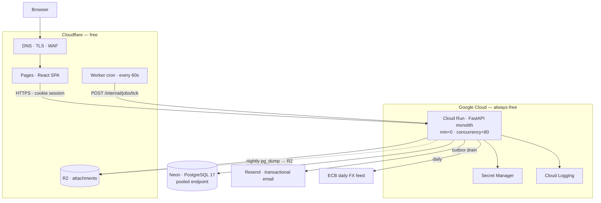

# XLR8 FLO — Final Build Plan

> **Supersedes:** `docs/codex-plan.md` (architecture ADRs) and `docs/nemotron-plan.md` (delivery plan).
> **Governs:** `docs/requirements.md` remains the requirements baseline. This document resolves its open decisions, adds the requirements it is missing, and defines how the build is executed.
> **Status:** Approved baseline. Changes to §1, §2, or §5 require a decision-log entry.
> **Last revised:** 24 August 2026

## 📑 Contents

1. [Decision log](#1--decision-log)
2. [Architecture](#2--architecture)
3. [Refined and added requirements](#3--refined-and-added-requirements)
4. [Delivery phases](#4--delivery-phases)
5. [Product roadmap](#5--product-roadmap)
6. [Agent operating model](#6--agent-operating-model)
7. [Graduation plan](#7--graduation-plan)
8. [Risks](#8--risks)

---

## 1. 🧭 Decision log

Every row is a decision that was contested between the two prior plans, or an open item in `requirements.md` §14. Each has a **revisit trigger** — the observable condition that reopens it. Nothing here is revisited on opinion.

| # | Decision | Chosen | Rejected | Why | Revisit trigger |
|---:|---|---|---|---|---|
| D-01 | Cost boundary | $0 software **and** $0 infrastructure until 10 paying customers **or** 200 MAU | Nemotron's $155–525/mo serverless stack | The threshold is a business gate, not a technical one. Free tiers below cover the target load with headroom on compute. | Either threshold met (see §7) |
| D-02 | Compute | FastAPI modular monolith in one OCI container on **Google Cloud Run** always-free | Vercel (Hobby licence forbids commercial use), Fly.io (free tier withdrawn), Render free (spins down, no commercial SLA) | 2M req/mo + 180k vCPU-s free, scale-to-zero, commercial use permitted, and the artifact is a plain container — portable to any host without a rewrite. | >1.6M req/mo, or p95 cold start harms UX |
| D-03 | Database | **Neon** free Postgres 17 | Cloudflare D1/SQLite, Supabase free, document DB | The ledger needs `NUMERIC`, `SELECT … FOR UPDATE`, recursive CTEs, RLS and real transactions. D1 has no interactive transactions and a single writer — disqualifying for FIN-006/ACC-001. | Storage >400 MB of the 512 MB cap |
| D-04 | Frontend | **React 19 + TypeScript + Vite SPA** on Cloudflare Pages | Next.js on Vercel | Authenticated internal app: no SEO, no SSR value. Next.js App Router adds a server runtime we would then have to host. Pages is free, commercial, unlimited requests, TLS and custom domain included. | Public marketing site needed (build it separately) |
| D-05 | Identity | **In-app auth behind an `IdentityProvider` port** (argon2id, server sessions, TOTP MFA) | Keycloak day 1 (codex ADR-005), Clerk, Supabase Auth | Keycloak is a ~1 GB always-on JVM — incompatible with every scale-to-zero free tier. The port keeps AUTH-012 cheap: Phase 2 SSO swaps the adapter, business authorization never moves. | Phase 2 SSO, or first customer demands federation |
| D-06 | Tenancy | **Pooled multi-tenant**: one deployment, one database, `org_id` on every business row, Postgres RLS + application scope checks | Per-customer deployment (codex assumption) | 10 customers × their own stack does not fit any free tier, and RLS + repository-level scoping is defence in depth for SEC-008/ACC-004. | A customer contractually requires isolated data |
| D-07 | Files | **Cloudflare R2** free (10 GB, zero egress), S3 API via `boto3` behind a `Storage` port | Local filesystem (lost on scale-to-zero), S3 (egress cost) | Cloud Run has no durable disk. Zero egress matters because attachments are downloaded far more than uploaded. | >8 GB stored |
| D-08 | Jobs | **Postgres queue** (`FOR UPDATE SKIP LOCKED`) drained by `POST /internal/jobs/tick`, triggered by a free Cloudflare Worker cron | Upstash Redis (nemotron), Celery, always-on worker | A broker is a second dependency and a second failure mode for a queue that will see hundreds of jobs a day. Same transaction as the business write = no lost jobs. | Sustained backlog, or sub-minute latency required |
| D-09 | Outbound effects | **Transactional outbox** + provider idempotency keys | Direct send from request handler | ARCH-006, PO-012, PO-015. A PO must never be sent twice or lost because the request died after commit. | — |
| D-10 | Email | **Resend** free (3k/mo, 100/day) behind an `EmailSender` port; SMTP adapter kept | SendGrid/SES (nemotron) | Free tier, modern API, DKIM setup is scripted. The port means the provider is a config change. | >80 emails/day sustained |
| D-11 | Balances | Rollup table maintained **in the same transaction** as the ledger write, plus a nightly recompute that **reports** drift | Materialized views refreshed on change (nemotron) | `REFRESH MATERIALIZED VIEW` is not transactional — a dashboard could show a balance that no ledger state ever produced, breaking FIN-005 and BUD-013. | — |
| D-12 | Custom fields | Relational definitions + **JSONB values** with GIN index; fields flagged searchable get a generated column + btree | Pure EAV (nemotron) | EAV makes every report a self-join pile. JSONB keeps CUS-009 answerable without a schema migration per field. | — |
| D-13 | Infrastructure as code | **Deferred.** Deploy scripts in CI (`gcloud run deploy`, `wrangler`); vendor consoles configured once and documented in `infra/SETUP.md` | Terraform day 1 (nemotron) | Two vendors, one environment, one operator. Terraform state is a liability before it is an asset. | Second environment, or second operator |
| D-14 | Malware scanning | Allow-list + magic-byte verification + size cap + quarantine-until-cleared + **SHA-256 reputation lookup** (hash only, never the file) | ClamAV in-process (300 MB signature DB — will not fit), uploading customer files to a third party | COL-005 is not waived: the compensating controls are named, the residual risk is accepted in writing, and full AV is a hard gate at graduation (E19-S04). | Graduation, or first attachment-borne incident |
| D-15 | Architecture style | **Modular monolith** with enforced import boundaries (`import-linter` in CI) | Microservices | Agreed with codex-plan. Budget, requisition and PO operations are one transaction; distributing them buys nothing and costs consistency. | A module needs independent scaling, with evidence |
| D-16 | Sourcing exemption | **None.** SRC-018 stands: no PO without a completed RFQ | Day-1 exemption flag | You chose the full money loop as the first sellable milestone. Relaxing SRC-018 on day 1 would hollow out GOAL-004. | A customer contract requires spot-buy |

### 1.1 Open decisions from `requirements.md` §14 — now closed

| §14 # | Topic | Resolution |
|---:|---|---|
| 1 | Cost constraint | D-01. Zero infrastructure cost too, until the graduation trigger. |
| 2 | Roll mode | Set per BU/OU, inherited by projects, **no project-level override** (one rule per unit is auditable; per-project overrides make roll-up unprovable). |
| 3 | Deferred project | `Deferred` reachable from `Active` only. Returns to `Active`, or goes to `Completed`/`Abandoned` after open activity resolves (PROJ-018). |
| 4 | Requisition-generated sub-project | May receive transfers and manual actuals; may **not** receive another requisition (REQ-003). Editable name/dates; budget only via transfer. |
| 5 | Budget lifecycle | Requisition approval **reserves**; PO issue **commits**; confirmed actual **expenses**. PO *approval* does not commit — only issue does, so a failed transmission never strands a commitment. |
| 6 | Tax/freight | Independent booleans per BU/OU, applied per document type, always separately visible (FIN-008, PO-016). |
| 7 | Cross-hierarchy transfer | One transaction, one `transfer_group_id`, balanced entries at every ancestor level (BUD-003, BUD-004). |
| 8 | Multi-currency | Org sets a base currency. Documents keep original currency. Rates from the **ECB daily reference feed** (free, no key), stored with effective date and source. Conversion never mutates a bid (SRC-010). |
| 9 | Approval rejection | Returns to `Draft` by default; `Final Reject` is a per-workflow option. |
| 10 | Approval membership | Snapshot at task creation (APR-018). |
| 11 | Approval depth | Logically unlimited; hard operational limit **20 steps**, configurable down. |
| 12 | Vendor scope | Global vendor may be locally disabled, never locally rewritten (VEN-009, VEN-013). |
| 13 | Inventory | FIFO for physical assignment, weighted average for valuation (AST-004, AST-005). |
| 14 | Actual expenditure | Phase 1 source is an **authorized manual actual** with evidence. Goods receipt arrives in E14. |
| 15 | SSO | D-05. Port now, adapter in Phase 2. |
| 16 | Availability/recovery | Free tier cannot honour 99.5%/RTO 8h. Stated target while free: **best-effort, RPO ≤ 24 h, RTO ≤ 48 h**, disclosed in the ToS. The requirements' targets become binding at graduation. |
| 17 | Retention | Financial and audit records: 7 years, archived to R2 after 90 days in Postgres. All other classes configurable per org. |
| 18 | Data volumes | Reference load defined in §2.3. |
| 19 | Threshold approvals | Amount conditions ship in Phase 2 with the engine (APR-005 already requires "any attribute", which includes amount — APR-010 is redundant and folded in). |
| 20 | Goods receipt | E14, Phase 4. AP/payment stays out of scope. |

---

## 2. 🏛️ Architecture

### 2.1 The constraint, stated precisely

> Every mandatory component must be **free for commercial use at our scale**, with a documented free-tier limit, a monitored headroom metric, and a named paid successor. Nothing in the build may depend on a vendor feature that has no portable equivalent.

Vercel's Hobby plan was excluded on this rule alone: it is free, but its terms forbid commercial use — which is exactly what a paying customer is.

### 2.2 Components

| Concern | Choice | Free-tier limit | Projected use at 10 customers / 200 MAU | Headroom | Paid successor |
|---|---|---|---|---|---|
| Static web | Cloudflare Pages | Unlimited requests, 500 builds/mo | ~200 builds/mo | Large | Pages Pro $20 |
| API compute | Cloud Run (us-central1) | 2M req, 180k vCPU-s, 360k GiB-s /mo | ~130k req, ~20k vCPU-s | **~15×** | ~$8–15/mo with `min-instances=1` |
| Database | Neon free | 512 MB storage, 190 compute-h/mo, 24 h PITR | **~300–400 MB**, ~60 compute-h | **Tight — binding constraint** | Neon Launch $19 |
| Object storage | Cloudflare R2 | 10 GB, 1M Class A, 10M Class B ops, **0 egress** | ~3–6 GB attachments | Moderate | $0.015/GB-mo |
| Email | Resend free | 3,000/mo, **100/day** | ~40–90/day | **Tight — second binding constraint** | Resend Pro $20 |
| Cron | Cloudflare Worker cron trigger | 100k req/day | ~1,440/day | Large | — |
| DNS / TLS / WAF / CDN | Cloudflare free | — | — | Large | — |
| Logs | Cloud Logging | 50 GiB/mo | ~2–5 GiB | Large | $0.50/GiB |
| Secrets | GCP Secret Manager | 6 active versions, 10k access/mo | ~10 secrets | Large | negligible |
| CI | GitHub Actions | 2,000 min/mo private | ~600–1,200 min/mo | Moderate | $0.008/min |
| Registry | Artifact Registry | 0.5 GB | ~0.4 GB with aggressive pruning | **Tight** | $0.10/GB-mo |
| FX rates | ECB daily reference XML | Unlimited, no key | 1 fetch/day | Large | — |

**Only real cost: a domain, ~$12/year.**

The two binding constraints are **Neon storage** and **email/day** — not compute, which every prior plan assumed. Both are designed around in §2.9.

### 2.3 Reference load (closes §14.18)

| Dimension | Phase-1 acceptance figure |
|---|---|
| Organizations | 10 |
| Users | 200 MAU, 40 concurrent peak |
| Projects (incl. sub-projects) | 5,000 |
| Ledger entries | 150,000 |
| Requisitions / RFQs / POs | 6,000 / 3,000 / 4,000 |
| Attachments | 20,000 files, ≤ 25 MB each, ≤ 6 GB total |
| Largest import | 10,000 rows |
| Grid page | 50 rows, virtualized |

PERF-001/002/003 are measured against these figures, with cold start excluded and reported separately.

### 2.4 Deployment topology



Four vendors, each replaceable: container runtime, Postgres wire protocol, S3 API, HTTP email. No vendor-proprietary runtime feature is used anywhere in application code.

### 2.5 Application structure

One container, one process, bounded modules. Module boundaries are those in `requirements.md` §12.6 and are **enforced by `import-linter` in CI** — a module that imports another module's internals fails the build, not the review.

```
apps/api/src/flo/
  kernel/          # cross-cutting: db session, RLS scope, errors (RFC 9457), idempotency,
                   # audit, outbox, jobs, storage port, email port, identity port, money, clock
  modules/
    org/           # organization, BU/OU, addresses, master data
    identity/      # users, sessions, MFA, roles, permissions, effective-access
    projects/      # hierarchy, lifecycle, milestones, risks
    budget/        # ledger, balances, transfers, adjustments, periods
    requisitions/  # header, lines, catalogue, generated sub-projects
    approvals/     # definitions, versions, instances, tasks, decisions
    vendors/       # profiles, contacts, documents, questionnaires, scores
    sourcing/      # RFQs, invitations, bids, comparison, awards
    purchasing/    # POs, change orders, snapshots, transmissions
    assets/        # warehouses, stock movements, fixed assets
    reporting/     # read models, KPI definitions, exports
    tenancy/       # provisioning, plans, quotas, MAU metering
  api/             # routers only: parse, authorize, call a module service, serialize
```

Rules that make this hold:

- A module exposes a `service.py` and `schemas.py`. Everything else is private.
- A module never imports another module's `models`, `repo` or `db` — only its `service` and `schemas`.
- Cross-module writes happen through the caller's service inside the **same transaction**, or through the outbox where eventual consistency is acceptable (ARCH-006).
- `api/` contains no business rules. A conditional on a money amount in a router is a review rejection.

### 2.6 The money path

This is the part that must be right; everything else is CRUD around it.

**Storage.** `NUMERIC(18,4)` for all amounts, `CHAR(3)` ISO 4217 currency alongside every amount, Python `Decimal` end to end. `float` is banned in `budget/`, `purchasing/`, `sourcing/` and `requisitions/` by a CI lint rule, not by convention (FIN-001).

**Ledger.** Append-only, one table:

```sql
CREATE TABLE ledger_entry (
  id                BIGSERIAL PRIMARY KEY,
  org_id            UUID        NOT NULL,
  bu_id             UUID        NOT NULL,
  project_id        UUID        NOT NULL,
  entry_type        ledger_type NOT NULL,   -- allocation|reservation|commitment|actual
                                            -- |release|reversal|transfer|adjustment
  amount            NUMERIC(18,4) NOT NULL, -- signed; sign is determined by entry_type
  currency          CHAR(3)     NOT NULL,
  source_type       TEXT        NOT NULL,   -- requisition|purchase_order|manual|transfer|import
  source_id         UUID,
  transfer_group_id UUID,                   -- BUD-004: all legs of one transfer share this
  reverses_entry_id BIGINT REFERENCES ledger_entry(id),
  department_code   TEXT, ledger_account_code TEXT,
  effective_date    DATE        NOT NULL,
  posted_at         TIMESTAMPTZ NOT NULL DEFAULT now(),
  actor_id          UUID        NOT NULL,
  reason            TEXT,
  idempotency_key   TEXT,
  UNIQUE (org_id, idempotency_key)
);
CREATE TRIGGER ledger_entry_append_only
  BEFORE UPDATE OR DELETE ON ledger_entry
  FOR EACH ROW EXECUTE FUNCTION raise_append_only();
```

Corrections are reversal + replacement rows (FIN-004). The trigger means a buggy agent-written `UPDATE` fails in the database, not in production.

**Balances.** `project_balance` holds `allocated / reserved / committed / actual / available`, updated in the **same transaction** as the ledger insert. A nightly job recomputes every balance from the ledger and writes a `balance_drift` report — it never silently corrects (BUD-013). Any non-zero drift is a P1 alert.

**Concurrency (ACC-001).** Every budget-consuming command runs:

```python
# 1. lock the funding row for the duration of the transaction
row = session.execute(
    select(ProjectBalance)
    .where(ProjectBalance.project_id == project_id)
    .with_for_update()
).scalar_one()
# 2. validate against the locked value
if row.available < amount and not policy.allow_negative:
    raise InsufficientBudget(available=row.available, requested=amount)
# 3. insert ledger entry + update balance, same transaction
```

Two concurrent requisitions therefore serialize on the row lock; the second sees the first's effect. This is a required test, not an aspiration — `test_concurrent_reservation_cannot_overspend` runs two real sessions against a real Postgres.

**Idempotency (DATA-003, FIN-012, PO-012).** Every state-changing `POST` accepts `Idempotency-Key`. Middleware stores `(org_id, key) → response` and replays the stored response on a repeat, keyed additionally on a request-body hash so a reused key with different content is a 422, not a silent wrong answer.

**Transfers (BUD-003).** One transaction, one `transfer_group_id`, balanced legs at every ancestor of both sides, resolved by recursive CTE. All legs commit or none.

### 2.7 Tenancy and authorization

Three independent layers — any one failing does not leak data:

1. **Session context.** Every request resolves `org_id` from the session, never from the URL or body. A request that names an org it is not scoped to is a 404, not a 403 (do not confirm existence).
2. **RLS.** `SET LOCAL app.org_id = …` at transaction start; every business table has `USING (org_id = current_setting('app.org_id')::uuid)`. Works under PgBouncer transaction pooling because `SET LOCAL` is transaction-scoped.
3. **Repository scope.** Every query goes through a base repository that requires an explicit scope object (`org_id`, plus `bu_ids` where the module is BU-scoped). A query built without one does not compile past the type checker.

BU/OU scope, project permissions and separation of duty (USR-007, APR-019) live in the application, evaluated server-side on every protected operation (USR-005). An `effective-access` endpoint explains *why* a user has a permission (USR-010) and an `explain-routing` endpoint explains *why* an approver was selected (APR-021) — both are requirements that are almost never built unless they are stories, so they are stories.

### 2.8 Frontend

| Concern | Choice | Note |
|---|---|---|
| Framework | React 19 + TypeScript strict + Vite | SPA, no SSR |
| Routing | TanStack Router | Type-safe params, search-param state for saved views |
| Server state | TanStack Query | Cache, optimistic updates, retry |
| Client state | Zustand, sparingly | Only shell state: theme, sidebar, palette |
| Tables | TanStack Table + `@tanstack/react-virtual` | XFN-002 grid behaviour, PERF-005 virtualization |
| Charts | Apache ECharts | RPT-005; every chart ships an accessible data table (RPT-013, A11Y-009) |
| Forms | React Hook Form + Zod | Zod schemas generated from OpenAPI |
| Primitives | Radix UI, app-owned components | No theme lock-in; "neutral chrome, chromatic data" is ours to control |
| Styling | Tailwind CSS v4 + design tokens | Light/dark from one token set (UX-006) |
| Workflow builder | `@dnd-kit` **plus** a keyboard/list editor with identical capability | APR-002 and A11Y-003 are acceptance criteria, not a follow-up |
| API client | `openapi-typescript` + `openapi-fetch`, generated in CI | The type bridge across the Python/TS split; a drifting client fails the build |
| Design system | **`design-system/MASTER.md`** — tokens, type scale, density, motion, component specs, UI definition of done | Binding on every UI story. Style is *Data-Dense Dashboard × Swiss Minimalism*: neutral chrome, colour reserved for status, money direction and module wayfinding. Hardcoding a value instead of a token is a blocking review finding |

**The language split is deliberate.** Python earns its place on import/export (`openpyxl`, `pandas`), PDF (`WeasyPrint`), and decimal-heavy financial rules. The cost — two languages — is paid once, at the OpenAPI boundary, by a generator. Agents never hand-write a request type.

### 2.9 Operations on a free tier

**Backups (REL-004/005/006).** Neon free retains 24 h of PITR — insufficient. Nightly job: `pg_dump -Fc` → gzip → R2 under `backups/YYYY/MM/DD/`, 30 dailies + 12 monthlies retained. **A restore drill into a Neon branch runs monthly and its evidence is committed to `docs/ops/restore-drills/`.** An untested backup is not a backup; this is a merge-blocking story (E19-S05), not a runbook line.

**Neon storage headroom (the binding constraint).**
- Attachments never touch Postgres — metadata only (ARCH-005).
- `audit_log` and `ledger_entry` are partitioned monthly; partitions older than 90 days are exported to R2 as JSONL and detached. Auditors query archived periods through a restore path (AUD-009).
- A daily job records `pg_database_size` and alerts at 60 % / 80 % / 90 % of 512 MB.

**Email headroom (the second binding constraint).** POs are transactional and always send immediately. Notifications are **batched into a per-user digest** (default hourly, XFN-005 preference-configurable) so a workflow storm cannot consume the 100/day cap and block a PO. Mandatory security notices bypass batching. The outbox tracks per-day send count and shifts non-critical mail to the next window before the cap is hit.

**Cold start.** `min-instances=0` means a first request after idle pays ~1–2 s. Accepted while free, disclosed in the ToS, excluded from PERF-001 and measured separately. The cron tick every 60 s keeps an instance warm during business hours at no cost.

**Observability (OBS-001…006).** Structured JSON to stdout with `trace_id`, `org_id`, `user_id`, `story_id` of the deploying commit. OpenTelemetry SDK is wired from day 1 with the exporter disabled — enabling a backend later is configuration, not instrumentation work. Business monitors (OBS-004) — stuck approvals, non-zero balance drift, expired vendor documents, failed transmissions — are queries on a `/internal/health/business` endpoint the cron checks.

**Secrets (SEC-005).** GCP Secret Manager, injected as Cloud Run env vars. Nothing in the repo, nothing in the browser bundle, `gitleaks` in CI.

### 2.10 Portability

| Vendor | Replaced by | Effort |
|---|---|---|
| Cloud Run | Any container host (Fly, Hetzner + Podman, Oracle free VM) | Change a deploy script |
| Neon | Any Postgres 17 | Change `DATABASE_URL` |
| R2 | Any S3-compatible store | Change endpoint + credentials |
| Resend | SMTP or any provider | Swap the `EmailSender` adapter |
| Cloudflare Pages | Any static host | Change a deploy script |

This is the insurance premium on betting a business on free tiers, and it satisfies COMP-003, COMP-004 and ARCH-011 as written.

---

## 3. 📋 Refined and added requirements

`requirements.md` is a strong internal-application specification. It is not yet a **SaaS** specification — there is no way for a customer to arrive, no way to know when 200 MAU is reached, and no legal surface. The blocks below are additive; existing IDs are unchanged.

### 3.1 Tenancy and commercial lifecycle — `TEN-*`

| ID | Requirement |
|---|---|
| TEN-001 | A tenant (organization) must be provisionable by an operator in Phase 0 and self-serve from Phase 5, producing an isolated `org_id`, a first Organization Administrator, and seeded master data. |
| TEN-002 | Tenant provisioning must be idempotent and reversible before first business transaction. |
| TEN-003 | **MAU must be defined and metered**: a distinct user with ≥1 authenticated session in a rolling 30-day window, counted per organization and in total, exposed on an internal dashboard. Without this the free-tier exit trigger is unobservable. |
| TEN-004 | Plan limits (users, projects, storage, monthly emails) must be data-driven per tenant, enforced server-side, and produce an actionable error naming the limit and the upgrade path. |
| TEN-005 | Quota enforcement must never block a read, an export of the tenant's own data, or a security-critical action. |
| TEN-006 | A billing hookpoint must exist — plan, status, and period on the tenant record — with no payment processor integrated in Phase 1. |
| TEN-007 | Tenant suspension must block sign-in and writes while preserving reads and export for a configurable grace period. |
| TEN-008 | A tenant must be able to export all its business data and attachments in documented formats, unattended (COMP-005). |
| TEN-009 | Tenant deletion must honour financial and audit retention, de-identify where history must remain, and produce a certificate of deletion. |
| TEN-010 | Cross-tenant isolation must be covered by an automated test suite that runs on every merge, asserting that tenant A cannot read, write, search, export, or enumerate tenant B by any route. |
| TEN-011 | A demo/sandbox tenant with representative seed data must exist for sales and for agent development, and must be visibly marked as non-production. |
| TEN-012 | Self-serve signup must have anti-abuse controls: email verification, rate limiting per IP and per domain, and disposable-domain blocking. |

### 3.2 Free-tier operations — `OPS-*`

| ID | Requirement |
|---|---|
| OPS-001 | Every free-tier limit in §2.2 must have an automated headroom metric with 60/80/90 % alerts. |
| OPS-002 | Each graduation trigger in §7 must have a named owner, a pre-agreed action, and a costed successor. |
| OPS-003 | Database and attachment backups must be verified by a **monthly restore drill with committed evidence**. |
| OPS-004 | The application must degrade rather than fail when a free-tier limit is reached: email queues instead of erroring, exports queue instead of erroring, writes fail last. |
| OPS-005 | Every external free dependency must have a documented fallback and a maximum tolerable outage. |
| OPS-006 | Cold-start latency must be measured and reported separately from PERF-001. |
| OPS-007 | A single command must reproduce the full stack locally (Postgres, MinIO, mail catcher) with no cloud account. |

### 3.3 Email deliverability — `EML-*`

The requirements make email the Phase-1 PO transmission channel (PO-004) but never require it to **arrive**.

| ID | Requirement |
|---|---|
| EML-001 | The sending domain must publish SPF, DKIM and DMARC, verified by an automated check before first customer send. |
| EML-002 | Bounces and complaints must be ingested, stored against the vendor contact, and surfaced on the PO transmission record. |
| EML-003 | A hard-bounced or complained address must enter a suppression list and must not be retried silently; the PO must show as undelivered and be actionable (PO-015). |
| EML-004 | Non-critical notifications must be batched into digests so transactional sends are never starved by the daily cap. |
| EML-005 | Vendor-facing email must never include internal-only notes or attachments (PO-017); this must be covered by an automated test. |
| EML-006 | Every send must record provider message id, recipient, template version, document snapshot id, and result (PO-004). |

### 3.4 Document numbering — `SEQ-*`

| ID | Requirement |
|---|---|
| SEQ-001 | Project, requisition, RFQ, award, PO and asset numbers must be unique within their configured organization/BU/OU scope (PROJ-019, PO-006). |
| SEQ-002 | Numbering must be **monotonic but not gapless**; gaps from rolled-back transactions are acceptable and must be documented for auditors. Gapless numbering would require a serialized counter and is not worth the contention. |
| SEQ-003 | The format must be configurable per scope (prefix, year segment, width) and must not be reinterpreted retroactively. |
| SEQ-004 | Number allocation must be concurrency-safe and must not reuse a number after a rollback. |

### 3.5 Currency and rates — `FX-*`

| ID | Requirement |
|---|---|
| FX-001 | Each organization must declare a base currency; documents retain their original currency (FIN-002). |
| FX-002 | Rates come from the ECB daily reference feed, stored with rate, source, and effective date, retained permanently. |
| FX-003 | A conversion shown to a user must display rate, source and effective date, and must never mutate the source document (SRC-010, FIN-003). |
| FX-004 | A missing rate for a required date must block the conversion with an actionable error, never fall back to a stale rate silently. |

### 3.6 Status, tags, and label groups — `TAG-*`

Every transactional and budget document carries **two** classification affordances with opposite rules. `requirements.md` specifies neither, and conflating them is how a strict status vocabulary decays into decoration.

| ID | Requirement |
|---|---|
| TAG-001 | Every transactional and budget document must display a **status badge** drawn from a closed, per-document-type vocabulary mapped to one of five semantic tones (neutral, info, success, warning, danger). |
| TAG-002 | Status tone must be **derived from status, never authored**. A tenant, administrator or user must not be able to recolour a status or add a status value without a code change and a workflow-version bump. |
| TAG-003 | A status badge must always render tone colour **and** an icon **and** text. It must never be a bare coloured dot. |
| TAG-004 | Tenants must be able to define **tags** (custom labels) applicable to configured document types, independent of status. |
| TAG-005 | Tags must be organized into **label groups** — named dimensions such as Risk Tier, Funding Source, CapEx Category — that own their tags. |
| TAG-006 | A label group must declare single- or multi-select, whether it is required on a document type, and whether it is a **reporting dimension**. |
| TAG-007 | A group marked as a reporting dimension must automatically become available as a group-by axis, a filter facet, and an export column, with no per-report implementation. |
| TAG-008 | Tag colour must be selected from a **pre-verified swatch set** whose every member meets 4.5:1 against its own tint in both light and dark themes. Arbitrary tenant-supplied colour values must not be accepted. |
| TAG-009 | A tag with no colour preference must be assigned one deterministically from its name, so the same tag is the same colour for every user, permanently. |
| TAG-010 | Tags and status badges must be **visually distinguishable in greyscale** — by shape and weight, not by colour alone (§7.1/§7.2 of the design system: status is a square-ish filled tint with an icon; a tag is a pill outline with a dot). |
| TAG-011 | A tag referenced by any document must not be deletable; it may be retired, hiding it from new entry while preserving history (consistent with ORG-009). |
| TAG-012 | Tag and group names are tenant-supplied data: length-capped, never rendered as raw HTML, and always shown with their group as context in filters (`Risk Tier: High`) so groups may share tag names. |
| TAG-013 | Tags must be scoped by organization and BU/OU, and must respect field-level authorization where a group is marked sensitive. |
| TAG-014 | Tag and group changes must be audited, and must not retroactively reinterpret historical values (consistent with CUS-007). |
| TAG-015 | Grids must render at most three tags inline per row, with the remainder behind a `+n` affordance reachable by hover **and** keyboard focus. |
| TAG-016 | Saved views and reports must be able to filter on any tag, any group, and the absence of a required group value. |

### 3.7 Support and product surface — `SUP-*`

| ID | Requirement |
|---|---|
| SUP-001 | Every user-facing error must display a correlation id that support can use without exposing business data (OBS-006). |
| SUP-002 | An in-app feedback control must capture the current route, correlation id and tenant. |
| SUP-003 | A public status page must exist before the first external customer. |
| SUP-004 | Incomplete modules must be hidden behind per-tenant feature flags, not partially exposed — phases are long and the app ships continuously. |
| SUP-005 | Administrator and operator documentation must be updated in the same PR as the feature it describes (UX-010). |

### 3.8 Legal — `LEG-*`

| ID | Requirement |
|---|---|
| LEG-001 | Terms of Service, Privacy Policy and a subprocessor list (Google, Cloudflare, Neon, Resend) must be published before the first external customer. |
| LEG-002 | A Data Processing Agreement template must be available on request. |
| LEG-003 | The ToS must disclose the free-tier availability posture in §1.1 row 16 honestly. |
| LEG-004 | A security incident notification commitment must be stated and operationally achievable. |

### 3.9 Corrections to existing requirements

| Existing ID | Change | Why |
|---|---|---|
| APR-010 | Fold into APR-005; amount thresholds ship with the engine in Phase 2 | APR-005 already requires conditions on "any document attribute". A separate Phase-2 item invites a second condition evaluator. |
| PO-008 | Commitment is created on **issue**, not approval | An approved-but-untransmitted PO holding a commitment strands funds when transmission fails (PO-015). |
| REL-001 / REL-005 | Restated for the free phase in §1.1 row 16; original targets bind at graduation | Publishing 99.5 % on `min-instances=0` would be a false commitment. |
| COL-005 | Malware scanning delivered as D-14's compensating controls until graduation, with the residual risk accepted in writing | Full AV does not fit the free tier; the requirement is not waived, its implementation is staged and gated. |
| PERF-001 | Excludes cold start, which is measured under OPS-006 | Otherwise the metric measures the hosting tier, not the application. |

---

## 4. 🚚 Delivery phases

Sized in **stories, not weeks** — throughput depends on agent caps (§6), so a week estimate would be fiction. Indicative rate at the current fleet is **3–5 stories/day**.

Each phase ends at a **milestone** (`M0`…`M5`). A milestone is the only thing that produces a pull request to `main` (§6.4).

| Milestone | Name | Delivers | Exit criteria | Stories |
|---|---|---|---|---:|
| **M0** | Rails | A deployed, empty, production-shaped application: sign in, one seeded tenant, an audited CRUD screen, CI green, agent orchestration proven end-to-end. Nothing business-valuable — everything the business logic will stand on. | Deployed to Cloud Run + Pages on a real domain; auth with MFA; RLS proven by the TEN-010 isolation suite; audit, idempotency, outbox, job runner, storage and email ports all exercised by a test; OpenAPI→TS client generated in CI; app shell with ⌘K, dark/light, virtualized grid; a11y harness failing on a seeded violation. | 24 |
| **M1** | Budget spine | The trustworthy system of record. Organizations, BU/OUs, master data, projects to five levels with roll-up/roll-down, and the complete budget ledger including cross-hierarchy transfers, plus Excel/CSV import. | ACC-001 and ACC-003 pass against real Postgres; every dashboard balance reconciles to its ledger; nightly drift report reads zero; 10,000-row import completes as a background job with a row-level error report. | 26 |
| **M2** | Governed demand | Capital requisitions that reserve real money, and the approval engine that authorizes them — including the visual builder and its keyboard equivalent. | A requisition moves Draft→Approved through a multi-level conditional workflow, generates its sub-project, and reserves budget atomically; editing the workflow does not alter in-flight documents (ACC-007); the builder is fully operable without a mouse (APR-002). | 24 |
| **M3** | **First sellable release** | Vendors, RFQs, bid comparison, awards, and purchase orders issued by email with change orders. Closes the money loop end to end. | ACC-002, ACC-005, ACC-006 pass; a complete project→requisition→RFQ→award→PO→email flow is operable without a mouse (ACC-008); PO PDF reproduces from its snapshot (PO-014); SPF/DKIM/DMARC verified (EML-001). **This is the first release you can sell.** | 28 |
| **M4** | Full Phase-1 scope | Warehouses and fixed assets, reporting and exports, custom fields and rules, search, notifications, preferences and help. Completes `requirements.md` Phase 1. | Every Phase-1 ✅ in `requirements.md` §2.2 is implemented and traced; HTML/PDF/Excel exports reconcile to the dashboard under identical filters (RPT-007). | 34 |
| **M5** | Customer-ready | Self-serve tenancy, plan quotas, MAU metering, security and accessibility verification, backup/restore evidence, legal surface, graduation dashboard. | ASVS L2 self-assessment complete with no open critical/high; WCAG 2.2 AA audit passed on critical paths; restore drill evidence committed; ToS/Privacy/DPA published; graduation triggers instrumented and alerting. | 24 |

**Total: 160 stories.**

Phase order is not negotiable and follows dependency, not preference: money before demand, demand before sourcing, sourcing before commitment. Reporting sits in M4 because a report of nothing is nothing.

---

## 5. 🗺️ Product roadmap

> **This table is generated.** The source of truth is `agents/roadmap.yaml`. Run `agents/scripts/flo roadmap` to regenerate. CI fails the build if this block drifts from the YAML (`flo roadmap --check`), which is the mechanism that keeps the roadmap current on every merge.

<!-- ROADMAP:BEGIN -->
<!-- generated by agents/scripts/flo roadmap — do not edit by hand -->

#### M0 — Rails · 5/24 done

> A deployed, empty, production-shaped application. No business value, everything the business logic stands on.

| | Story | Epic | Kind | Size | Requirements | Depends on |
|---|---|---|---|---|---|---|
| ✅ | **E01-S01** Monorepo skeleton, tooling, ruff/mypy/eslint/tsc config | E01 | chore | M | COMP-004 | — |
| ✅ | **E01-S02** Local stack: Postgres 17 + MinIO + Mailpit via one command | E01 | chore | M | OPS-007 | ~~E01-S01~~ |
| ✅ | **E01-S03** API container image, slim multi-stage, non-root, health endpoints | E01 | chore | M | REL-003 | ~~E01-S01~~ |
| ⬜ | **E01-S04** CI: lint, types, tests, gitleaks, import-linter, roadmap drift check | E01 | chore | L | SEC-012 | ~~E01-S03~~ |
| ⬜ | **E01-S05** Deploy API to Cloud Run and SPA to Cloudflare Pages from CI | E01 | chore | L | SEC-003, SEC-005, COMP-004 | E01-S04 |
| ⬜ | **E01-S06** Neon + R2 + Secret Manager wiring, infra/SETUP.md, registry pruning | E01 | chore | M | SEC-005, OPS-001 | E01-S05 |
| ⬜ | **E02-S01** IdentityProvider port + LocalIdentityProvider, argon2id, NIST password policy | E02 | security | L | AUTH-003, AUTH-004, AUTH-005, AUTH-007, D-05 | ~~E01-S02~~ |
| ⬜ | **E02-S02** Server sessions, httpOnly cookies, CSRF, idle and absolute timeout, revocation | E02 | security | L | AUTH-009, AUTH-010, SEC-007 | E02-S01 |
| ⬜ | **E02-S03** Password reset: single-use short-lived tokens, no account enumeration | E02 | security | M | AUTH-007, AUTH-008 | E02-S02 |
| ⬜ | **E02-S04** TOTP MFA, mandatory for privileged roles, step-up re-auth for high-risk actions | E02 | security | L | AUTH-006, SEC-009 | E02-S02 |
| ⬜ | **E02-S05** RBAC: roles, permissions, org/BU/project/record/action scope, default-deny | E02 | security | L | USR-001, USR-002, USR-003, USR-004, USR-005, USR-006 | E02-S02, ~~E03-S02~~ |
| ⬜ | **E02-S06** Effective-access explorer endpoint and screen | E02 | api | M | USR-010, USR-008, USR-009 | E02-S05 |
| ✅ | **E03-S01** Money primitives: Decimal, NUMERIC(18,4), central rounding, float lint ban | E03 | ledger | M | FIN-001, FIN-002, FIN-009 | ~~E01-S01~~ |
| ✅ | **E03-S02** Tenancy kernel: session org_id, RLS SET LOCAL, scoped repository base | E03 | security | L | SEC-008, ACC-004, D-06 | ~~E01-S02~~ |
| ⬜ | **E03-S03** RFC 9457 problem details, error taxonomy, no internal disclosure | E03 | api | M | ARCH-007, SEC-011, UX-005 | ~~E01-S01~~ |
| ⬜ | **E03-S04** Audit trail: append-only table, triggers, before/after, correlation id | E03 | security | L | AUD-001, AUD-002, AUD-003, AUD-004, AUD-006, AUD-010 | ~~E03-S02~~ |
| ⬜ | **E03-S05** Idempotency middleware keyed on (org, key, body hash) | E03 | concurrency | M | DATA-003, FIN-012, WF-004 | E03-S03 |
| ⬜ | **E03-S06** Job queue (SKIP LOCKED), outbox, cron tick endpoint, Storage and Email ports | E03 | engine | L | ARCH-006, REL-007, PERF-004, COL-006, D-07, D-08, D-10 | E03-S04 |
| ⬜ | **E04-S01** Design tokens, Tailwind v4 setup, light/dark, neutral chrome palette | E04 | ui | M | UX-006, A11Y-005 | ~~E01-S01~~ |
| ⬜ | **E04-S02** App shell: nav, breadcrumbs, command palette, focus management, skip links | E04 | ui | L | UX-001, XFN-010, A11Y-002 | E04-S01 |
| ⬜ | **E04-S03** Data grid: TanStack Table, virtualization, server filter/sort, saved views, grid semantics | E04 | ui | L | XFN-002, XFN-003, PERF-005, A11Y-008 | E04-S02 |
| ⬜ | **E04-S04** OpenAPI to TS client generation, forms kit, a11y harness (axe + keyboard) in CI | E04 | ui | L | A11Y-001, A11Y-006, A11Y-010, XFN-008 | E04-S03, E03-S03 |
| ⬜ | **E04-S05** StatusPill primitive: closed per-document-type tone map, icon always, never author-coloured | E04 | ui | M | TAG-001, TAG-002, TAG-003, A11Y-004 | E04-S01 |
| ⬜ | **E04-S06** Material layer: tinted shadows, lit edge, grain, honest glass, glow focus ring | E04 | ui | M | UX-006, A11Y-005 | E04-S01 |

#### M1 — Budget spine · 0/26 done

> The trustworthy system of record. Projects, hierarchy and the complete budget ledger.

| | Story | Epic | Kind | Size | Requirements | Depends on |
|---|---|---|---|---|---|---|
| ⬜ | **E05-S01** Organization and BU/OU with unique codes, settings precedence | E05 | crud | M | ORG-001, ORG-002, ORG-012 | E02-S05 |
| ⬜ | **E05-S02** Bill To / Ship To addresses with effective dates | E05 | crud | S | ORG-005 | E05-S01 |
| ⬜ | **E05-S03** Master data: departments, ledger accounts, UoM, tax codes, payment terms, categories | E05 | crud | L | ORG-010, ORG-011, ORG-009, XFN-009 | E05-S01 |
| ⬜ | **E05-S04** Fiscal calendar and period open/close with authorization and audit | E05 | engine | M | BUD-010, FIN-010 | E05-S01 |
| ⬜ | **E05-S05** FX: ECB daily rate ingest, rate table, effective dating, missing-rate block | E05 | engine | M | FX-001, FX-002, FX-003, FX-004, FIN-003 | E03-S06 |
| ⬜ | **E06-S01** Project entity, scoped numbering sequence, department and ledger account | E06 | crud | M | PROJ-001, PROJ-014, PROJ-019, SEQ-001, SEQ-002, SEQ-003, SEQ-004 | E05-S03 |
| ⬜ | **E06-S02** Five-level hierarchy with recursive CTE traversal and depth guard | E06 | engine | L | PROJ-004, PROJ-005 | E06-S01 |
| ⬜ | **E06-S03** Project lifecycle state machine with permission and budget-effect enforcement | E06 | engine | L | PROJ-012, PROJ-013, PROJ-018, WF-002, WF-006 | E06-S01 |
| ⬜ | **E06-S04** Roll-down and roll-up funding modes, set per BU/OU and inherited | E06 | ledger | L | PROJ-006, PROJ-007, PROJ-008 | E06-S02, E07-S02 |
| ⬜ | **E06-S05** Phases, milestones, planned vs actual dates, owner, sponsor, health, percent complete | E06 | crud | M | PROJ-011, PROJ-015 | E06-S01 |
| ⬜ | **E06-S06** Project risks with likelihood, impact, owner, mitigation, due date, status | E06 | crud | M | PROJ-016 | E06-S01 |
| ⬜ | **E06-S07** Project list and detail screens, filter/sort/group/search, saved views | E06 | ui | L | PROJ-020, XFN-002 | E06-S03, E04-S03 |
| ⬜ | **E06-S08** Project dashboard with hierarchy visual and drill-down to ledger entries | E06 | ui | L | PROJ-009, PROJ-021, RPT-002, RPT-003, A11Y-009 | E06-S07, E07-S06 |
| ⬜ | **E07-S01** Ledger schema, append-only triggers, entry types, partitioning, source linkage | E07 | migration | L | FIN-004, FIN-007, BUD-005, BUD-006, ARCH-003 | ~~E03-S01~~, E03-S04 |
| ⬜ | **E07-S02** project_balance rollup maintained in-transaction with the ledger write | E07 | ledger | L | FIN-005, FIN-006, BUD-011, D-11 | E07-S01 |
| ⬜ | **E07-S03** Allocation command with authorization, reason, effective date and audit | E07 | ledger | M | BUD-001, BUD-006, BUD-007 | E07-S02 |
| ⬜ | **E07-S04** Reservation and release primitives, exactly-once release guarantee | E07 | ledger | L | FIN-011, FIN-012, BUD-008, ACC-001, ACC-006 | E07-S02 |
| ⬜ | **E07-S05** Commitment, actual and reversal primitives with source-document lineage | E07 | ledger | L | FIN-004, FIN-011, AUD-007 | E07-S04 |
| ⬜ | **E07-S06** Balance query API: MTD/QTD/YTD/fiscal/life-to-date/range, reconcile to entries | E07 | api | M | BUD-009, BUD-011, ACC-003 | E07-S05 |
| ⬜ | **E07-S07** Same-level transfer, atomic, one transfer_group_id | E07 | ledger | M | BUD-002, BUD-004 | E07-S05 |
| ⬜ | **E07-S08** Cross-hierarchy transfer up-then-down through both ancestries, one transaction | E07 | ledger | L | BUD-003, BUD-004, WF-003 | E07-S07, E06-S02 |
| ⬜ | **E07-S09** Nightly reconciliation job: recompute from ledger, report drift, never correct | E07 | engine | M | BUD-013, OBS-004 | E07-S06, E03-S06 |
| ⬜ | **E08-S01** Import framework: template versioning, column mapping, type and reference validation | E08 | engine | L | IMP-001, IMP-002, IMP-003, IMP-004 | E03-S06 |
| ⬜ | **E08-S02** Dry-run preview, row/column error report, atomic or explicitly partial commit | E08 | engine | L | IMP-005, IMP-006, IMP-007 | E08-S01 |
| ⬜ | **E08-S03** Import batch record, idempotent re-import by external key, async with progress | E08 | engine | M | IMP-008, IMP-009, IMP-012, PERF-004 | E08-S02 |
| ⬜ | **E08-S04** Project and budget import templates end to end | E08 | crud | M | PROJ-001, IMP-001 | E08-S03, E07-S03 |

#### M2 — Governed demand · 0/24 done

> Requisitions that reserve real money, and the approval engine that authorizes them.

| | Story | Epic | Kind | Size | Requirements | Depends on |
|---|---|---|---|---|---|---|
| ⬜ | **E09-S01** Requisition header, scoped numbering, project-linked and standalone | E09 | crud | M | REQ-001, REQ-010, SEQ-001 | E06-S03 |
| ⬜ | **E09-S02** Item and service lines with explicit type tagging and quantity/amount tracking | E09 | crud | M | REQ-006, REQ-015 | E09-S01 |
| ⬜ | **E09-S03** Catalogue: BU/OU-scoped suggestions from prior requested, sourced and purchased items | E09 | engine | M | REQ-007, REQ-008, XFN-009 | E09-S02 |
| ⬜ | **E09-S04** Submission validation: fields, active master data, eligibility, funds, routing | E09 | engine | L | REQ-011, WF-002, WF-006 | E09-S02, E07-S06 |
| ⬜ | **E09-S05** Requisition lifecycle state machine | E09 | engine | L | REQ-005, REQ-016, WF-002 | E09-S04 |
| ⬜ | **E09-S06** Approval reserves budget and generates the sub-project, one transaction | E09 | ledger | L | REQ-002, REQ-003, REQ-004, PROJ-003, ACC-001, WF-003 | E09-S05, E07-S04, E10-S05 |
| ⬜ | **E09-S07** Release on reject, withdraw, cancel, expire or reduce — exactly once | E09 | ledger | M | REQ-013, FIN-011, ACC-006 | E09-S06 |
| ⬜ | **E09-S08** Controlled return, amendment and resubmission preserving prior values | E09 | engine | M | REQ-012, APR-015, DATA-002 | E09-S05 |
| ⬜ | **E09-S09** Linked-record graph: RFQs, bids, awards, POs, approvals, notes, ledger entries | E09 | api | M | REQ-009, WF-001 | E09-S06 |
| ⬜ | **E09-S10** Notes and attachments on all business documents, upload validation, quarantine | E09 | security | L | COL-001, COL-002, COL-003, COL-004, COL-005, COL-006, COL-007, COL-008, D-14 | E03-S06 |
| ⬜ | **E09-S11** Requisition screens: create, lines, submit, track, quantity rollup | E09 | ui | L | REQ-015, UX-003, UX-004 | E09-S09, E04-S03 |
| ⬜ | **E10-S01** Workflow definition schema, versioning, active-document version pinning | E10 | migration | L | APR-011, ACC-007 | E03-S04 |
| ⬜ | **E10-S02** Condition evaluator over any document attribute including amount and custom fields | E10 | engine | L | APR-005, APR-010 | E10-S01 |
| ⬜ | **E10-S03** Graph validation: cycle detection, unreachable steps, duplicate approvals, depth limit | E10 | engine | M | APR-006, APR-007, APR-008, APR-012 | E10-S01 |
| ⬜ | **E10-S04** Approver eligibility resolution scoped to organization and BU/OU | E10 | engine | M | APR-004, APR-019, USR-007 | E10-S02, E02-S05 |
| ⬜ | **E10-S05** Execution engine: instances, tasks, any-one/all/quorum groups, membership snapshot | E10 | engine | L | APR-009, APR-018, WF-002 | E10-S04 |
| ⬜ | **E10-S06** Decisions: approve, reject, return, comment, withdraw; full attribution recorded | E10 | engine | M | APR-013, APR-014, AUD-001 | E10-S05 |
| ⬜ | **E10-S07** Stale-version guard and material-change resubmission policy | E10 | concurrency | M | APR-015, APR-016, DATA-002, WF-001 | E10-S06 |
| ⬜ | **E10-S08** Delegation, out-of-office, due dates, reminders and escalation | E10 | engine | L | APR-017 | E10-S06 |
| ⬜ | **E10-S09** Routing explainability: which rule matched and why this approver | E10 | api | M | APR-021 | E10-S05 |
| ⬜ | **E10-S10** Approval inbox: pending, overdue, completed, delegated views | E10 | ui | M | APR-020 | E10-S06, E04-S03 |
| ⬜ | **E10-S11** Visual workflow builder, drag-and-drop canvas | E10 | ui | L | APR-001 | E10-S03, E04-S02 |
| ⬜ | **E10-S12** Keyboard/list workflow editor with identical capability to the canvas | E10 | ui | L | APR-002, A11Y-003 | E10-S11 |
| ⬜ | **E10-S13** Wire workflows to projects, requisitions, vendors, RFQs, awards, POs, budget changes | E10 | engine | M | APR-003, PROJ-002, VEN-005, BUD-007 | E10-S07 |

#### M3 — First sellable release · 0/28 done

> Vendors, RFQs, awards and purchase orders by email. Closes the money loop end to end.

| | Story | Epic | Kind | Size | Requirements | Depends on |
|---|---|---|---|---|---|---|
| ⬜ | **E11-S01** Vendor profile, searchable list, global and BU/OU scope, local disable | E11 | crud | M | VEN-001, VEN-008, VEN-009, ORG-003 | E05-S01 |
| ⬜ | **E11-S02** Typed contacts: billing, service/delivery, additional types | E11 | crud | S | VEN-002 | E11-S01 |
| ⬜ | **E11-S03** Vendor documents with issue/expiry, verification status, expiry notification | E11 | crud | M | VEN-003, VEN-011, OBS-004 | E11-S01, E09-S10 |
| ⬜ | **E11-S04** Field-level access control and masking for tax and banking data | E11 | security | M | VEN-014, CUS-008, PRIV-001 | E11-S01, E02-S05 |
| ⬜ | **E11-S05** Onboarding request, configurable questionnaire, weights and scoring | E11 | engine | L | VEN-004, VEN-006 | E11-S01 |
| ⬜ | **E11-S06** Duplicate identifier detection, approval on create/activate/suspend/reactivate | E11 | engine | M | VEN-005, VEN-010, VEN-012 | E11-S05, E10-S13 |
| ⬜ | **E11-S07** Performance scoring across quality, price, delivery, service, with dispute history | E11 | crud | M | VEN-007, VEN-015 | E11-S01 |
| ⬜ | **E12-S01** RFQ from approved requisition lines, open-quantity guard | E12 | engine | L | SRC-001, SRC-003, SRC-018 | E09-S06, E11-S01 |
| ⬜ | **E12-S02** RFQ content, invitations, deadline, terms, attachments, vendor eligibility check | E12 | crud | M | SRC-002, VEN-012 | E12-S01 |
| ⬜ | **E12-S03** RFQ lifecycle and post-publication versioning communicated to invitees | E12 | engine | M | SRC-004, SRC-005 | E12-S02 |
| ⬜ | **E12-S04** Bid capture: line prices, currency, tax, freight, lead time, validity, exceptions | E12 | crud | M | SRC-006 | E12-S03 |
| ⬜ | **E12-S05** Bid confidentiality and late-bid block with audited override | E12 | security | M | SRC-007, SRC-008 | E12-S04 |
| ⬜ | **E12-S06** Comparison engine: normalized total and unit cost, tax, freight, lead time, vendor score | E12 | engine | L | SRC-009, SRC-010 | E12-S04, E05-S05 |
| ⬜ | **E12-S07** Evaluation scoring with comments and conflict-of-interest declarations | E12 | crud | M | SRC-011 | E12-S06 |
| ⬜ | **E12-S08** Award: split by line/quantity, scope and reserved-funds guard, non-lowest justification | E12 | ledger | L | SRC-012, SRC-013, SRC-014, SRC-016, REQ-014 | E12-S07, E07-S04 |
| ⬜ | **E12-S09** Cancel or supersede RFQ/award, preserve history, reconcile budget effect | E12 | ledger | M | SRC-017, SRC-015, WF-005 | E12-S08 |
| ⬜ | **E12-S10** Comparison dashboard screen with accessible table equivalent | E12 | ui | L | SRC-009, A11Y-009, RPT-013 | E12-S06, E04-S03 |
| ⬜ | **E13-S01** PO from awarded requisition lines or authorized project items, scoped numbering | E13 | crud | L | PO-001, PO-002, PO-006, SEQ-001 | E12-S08 |
| ⬜ | **E13-S02** Tax and freight per BU/OU policy, separately visible on line and document | E13 | ledger | M | FIN-008, FIN-009, PO-016 | E13-S01 |
| ⬜ | **E13-S03** PO lifecycle state machine | E13 | engine | M | PO-007, WF-002 | E13-S01 |
| ⬜ | **E13-S04** PO approval workflow before issue | E13 | engine | M | PO-003, APR-003 | E13-S03, E10-S13 |
| ⬜ | **E13-S05** Issue converts reservation to commitment atomically; partial POs reduce open quantity only | E13 | ledger | L | PO-008, PO-009, WF-003, ACC-002 | E13-S04, E07-S05 |
| ⬜ | **E13-S06** Immutable issued PO; numbered, approved change orders with field-level diff | E13 | engine | L | PO-010, PO-011, DATA-005, ACC-005 | E13-S05 |
| ⬜ | **E13-S07** Cancel or reduce releases unused commitment exactly once, history preserved | E13 | ledger | M | PO-013, FIN-011, ACC-006, WF-005 | E13-S06 |
| ⬜ | **E13-S08** PO PDF reproducible from stored snapshot and template version | E13 | engine | L | PO-014, DATA-005 | E13-S06 |
| ⬜ | **E13-S09** Email transmission via outbox, recipient/time/result/version recorded, retry without duplication | E13 | engine | L | PO-004, PO-012, PO-015, ARCH-006, ACC-002 | E13-S08, E03-S06 |
| ⬜ | **E13-S10** Deliverability: SPF/DKIM/DMARC verification, bounce and complaint handling, suppression list | E13 | engine | M | EML-001, EML-002, EML-003, EML-006 | E13-S09 |
| ⬜ | **E13-S11** Internal vs vendor-facing notes and attachments, enforced by test | E13 | security | M | PO-017, EML-005, COL-002 | E13-S09, E09-S10 |

#### M4 — Full Phase-1 scope · 0/34 done

> Assets, reporting, custom fields, search and notifications. Completes requirements.md Phase 1.

| | Story | Epic | Kind | Size | Requirements | Depends on |
|---|---|---|---|---|---|---|
| ⬜ | **E14-S01** Warehouses: locations, custodians, status, supported categories | E14 | crud | M | AST-001, AST-002, ORG-007 | E05-S01 |
| ⬜ | **E14-S02** Append-only stock movements: receipt, transfer, assignment, return, adjustment, disposal | E14 | migration | L | AST-003, AST-006, ARCH-003 | E14-S01 |
| ⬜ | **E14-S03** FIFO physical assignment with audited exception override | E14 | engine | M | AST-004 | E14-S02 |
| ⬜ | **E14-S04** Weighted-average valuation, negative-stock prevention | E14 | ledger | M | AST-005, AST-007 | E14-S02 |
| ⬜ | **E14-S05** Fixed-asset register with full attribute set and BU/OU linkage | E14 | crud | M | AST-008, ORG-006 | E14-S01 |
| ⬜ | **E14-S06** Asset creation from PO with lineage to the originating purchase | E14 | engine | M | AST-009, AUD-007 | E14-S05, E13-S05 |
| ⬜ | **E14-S07** Stock-count adjustment with reason and configurable approval; manual actual posting | E14 | ledger | M | AST-010, BUD-007 | E14-S04, E07-S05 |
| ⬜ | **E15-S01** Governed KPI registry: definition, source, calculation, time basis, currency, refresh | E15 | engine | M | RPT-001, RPT-006 | E07-S06 |
| ⬜ | **E15-S02** Read models and materialized summaries with as-of time and refresh status | E15 | engine | L | ARCH-004, RPT-014, PERF-003 | E15-S01 |
| ⬜ | **E15-S03** Row- and field-level authorization enforced at query time | E15 | security | M | RPT-012, SEC-008 | E15-S02, E02-S05 |
| ⬜ | **E15-S04** Drill-down: organization to BU/OU to project to document to transaction | E15 | api | M | RPT-002, PROJ-010 | E15-S03 |
| ⬜ | **E15-S05** Time analysis across year, fiscal period, quarter, month, week and range | E15 | api | M | RPT-004, BUD-009 | E15-S04, E05-S04 |
| ⬜ | **E15-S06** Executive dashboard, operational dashboards, configurable home dashboard | E15 | ui | L | PROJ-010, RPT-005, XFN-004, RPT-013 | E15-S05, E04-S03 |
| ⬜ | **E15-S07** Saved personal views and governed shared views | E15 | crud | M | RPT-008, XFN-003 | E15-S06 |
| ⬜ | **E15-S08** Export to HTML, PDF and Excel with context header, reconciling to the dashboard | E15 | engine | L | RPT-009, RPT-010, RPT-007, IMP-010, IMP-011 | E15-S06 |
| ⬜ | **E15-S09** Async long reports and bulk exports with progress and notification | E15 | engine | M | RPT-011, IMP-012, PERF-004 | E15-S08, E03-S06 |
| ⬜ | **E16-S01** Field definitions: types, scope, effective dates, order, permissions, retirement | E16 | engine | L | CUS-001, CUS-002, CUS-003, CUS-010 | E05-S03 |
| ⬜ | **E16-S02** JSONB values with GIN index; generated column plus btree for searchable fields | E16 | migration | L | CUS-009, D-12 | E16-S01 |
| ⬜ | **E16-S03** Field-level authorization, export and log exclusion for sensitive fields | E16 | security | M | CUS-008, AUD-006, IMP-010 | E16-S02, E02-S05 |
| ⬜ | **E16-S04** Propagation of project custom fields into downstream transactions | E16 | engine | M | CUS-004 | E16-S02 |
| ⬜ | **E16-S05** Rule engine: deterministic, versioned, auditable, cycle-protected | E16 | engine | L | CUS-005, CUS-006, CUS-007 | E16-S04 |
| ⬜ | **E16-S06** Custom fields in forms, grids, filters, imports and exports | E16 | ui | M | CUS-002, IMP-003, XFN-002 | E16-S05, E04-S04 |
| ⬜ | **E16-S07** Label groups and tags: scoped definitions, single/multi, required, retire-not-delete | E16 | engine | L | TAG-004, TAG-005, TAG-006, TAG-011, TAG-012, TAG-013, TAG-014 | E16-S01 |
| ⬜ | **E16-S08** Tag swatch palette: 14 pre-verified colours, deterministic assignment, no free-form hex | E16 | ui | M | TAG-008, TAG-009, TAG-010, A11Y-005 | E16-S07, E04-S05 |
| ⬜ | **E16-S09** Tag component and grid density: pill outline plus dot, max 3 inline plus overflow, keyboard reachable | E16 | ui | M | TAG-010, TAG-015, A11Y-002 | E16-S08 |
| ⬜ | **E16-S10** Reportable groups become group-by axis, filter facet and export column automatically | E16 | engine | L | TAG-007, TAG-016, RPT-008, IMP-010 | E16-S07, E15-S07 |
| ⬜ | **E17-S01** Global search over authorized records: identifiers, names, vendor, project, documents | E17 | api | L | XFN-001, SEC-008, SEC-010 | E15-S03 |
| ⬜ | **E17-S02** Notification engine: in-app and email channels, per-event preferences | E17 | engine | L | XFN-005, XFN-006, AUTH-001 | E03-S06 |
| ⬜ | **E17-S03** Digest batching so notifications never starve transactional email | E17 | engine | M | EML-004, OPS-004 | E17-S02 |
| ⬜ | **E17-S04** Safe notification content: authorized deep links, no sensitive data in subjects or previews | E17 | security | M | XFN-007, COL-009, AUD-006 | E17-S02 |
| ⬜ | **E17-S05** Mentions and subscriptions without exposing unauthorized records | E17 | engine | M | COL-009 | E17-S04 |
| ⬜ | **E17-S06** User preferences: locale, timezone, theme, notification settings, grid defaults | E17 | crud | M | AUTH-001, UX-007, XFN-003 | E04-S04 |
| ⬜ | **E17-S07** Contextual field help and tooltips across every screen | E17 | ui | M | XFN-008, UX-010 | E04-S04 |
| ⬜ | **E17-S08** Role-based onboarding tour, skippable, plus quick-start documentation | E17 | ui | M | UX-009, UX-010, SUP-005 | E17-S07 |

#### M5 — Customer-ready · 0/24 done

> Self-serve tenancy, verification, backup evidence, legal surface, graduation instrumentation.

| | Story | Epic | Kind | Size | Requirements | Depends on |
|---|---|---|---|---|---|---|
| ⬜ | **E18-S01** Operator tenant provisioning: idempotent, reversible, seeds admin and master data | E18 | engine | M | TEN-001, TEN-002 | E05-S03 |
| ⬜ | **E18-S02** Self-serve signup with email verification and anti-abuse controls | E18 | security | L | TEN-012, SEC-010, TEN-001 | E18-S01, E02-S03 |
| ⬜ | **E18-S03** MAU metering: distinct authenticated users per rolling 30 days, per tenant and total | E18 | engine | M | TEN-003, OPS-002 | E18-S01 |
| ⬜ | **E18-S04** Plan limits, server-side quota enforcement, actionable limit errors | E18 | engine | L | TEN-004, TEN-005, OPS-004 | E18-S03 |
| ⬜ | **E18-S05** Billing hookpoint on the tenant record; no processor integrated | E18 | crud | S | TEN-006 | E18-S04 |
| ⬜ | **E18-S06** Tenant suspension: block sign-in and writes, preserve read and export in grace period | E18 | security | M | TEN-007 | E18-S05 |
| ⬜ | **E18-S07** Unattended full tenant data and attachment export | E18 | engine | L | TEN-008, COMP-005, PRIV-005 | E18-S06, E15-S09 |
| ⬜ | **E18-S08** Tenant deletion honouring retention and legal hold, de-identification, deletion certificate | E18 | security | L | TEN-009, PRIV-002, PRIV-003, PRIV-006, AUD-008 | E18-S07 |
| ⬜ | **E18-S09** Demo tenant with representative seed data, visibly marked non-production | E18 | chore | M | TEN-011, PRIV-004 | E18-S01 |
| ⬜ | **E19-S01** Cross-tenant isolation suite covering read, write, search, export and enumeration | E19 | test | L | TEN-010, ACC-004, SEC-008 | E18-S02 |
| ⬜ | **E19-S02** ASVS 5.0 L2 self-assessment with evidence and threat models | E19 | security | L | SEC-001, SEC-002 | E19-S01 |
| ⬜ | **E19-S03** Browser protections: CSP, secure cookies, CSRF, clickjacking, HSTS; abuse throttling | E19 | security | M | SEC-007, SEC-010, SEC-003 | E19-S02 |
| ⬜ | **E19-S04** Attachment scanning gate: hash reputation lookup, quarantine, upgrade path to full AV | E19 | security | M | COL-005, COL-007, ACC-009, D-14 | E19-S03 |
| ⬜ | **E19-S05** Nightly pg_dump to R2, retention policy, monthly restore drill with committed evidence | E19 | engine | L | REL-004, REL-005, REL-006, OPS-003, ACC-010 | E03-S06 |
| ⬜ | **E19-S06** Free-tier headroom monitors with 60/80/90 percent alerts and degradation behaviour | E19 | engine | M | OPS-001, OPS-004, OPS-005, OBS-002 | E19-S05 |
| ⬜ | **E19-S07** Business monitors: stuck approvals, balance drift, expiring documents, failed transmissions | E19 | engine | M | OBS-003, OBS-004, OBS-005 | E19-S06 |
| ⬜ | **E19-S08** Performance baseline at reference load; cold start measured separately | E19 | test | L | PERF-001, PERF-002, PERF-003, PERF-006, OPS-006 | E19-S07 |
| ⬜ | **E19-S09** WCAG 2.2 AA audit of critical paths, keyboard and screen-reader review, remediation | E19 | test | L | A11Y-001, A11Y-007, A11Y-011, A11Y-012, ACC-008 | E17-S08 |
| ⬜ | **E20-S01** Terms of Service, Privacy Policy, subprocessor list, DPA template | E20 | docs | M | LEG-001, LEG-002, LEG-003 | E19-S02 |
| ⬜ | **E20-S02** Public status page and incident notification commitment | E20 | chore | M | SUP-003, LEG-004 | E19-S07 |
| ⬜ | **E20-S03** Correlation id surfaced in user errors; in-app feedback capture | E20 | ui | M | SUP-001, SUP-002, OBS-006 | E03-S03 |
| ⬜ | **E20-S04** Per-tenant feature flags so incomplete modules are hidden, never half-exposed | E20 | engine | M | SUP-004 | E18-S04 |
| ⬜ | **E20-S05** Administrator and operator documentation, runbooks linked from every alert | E20 | docs | M | UX-010, SUP-005, OBS-003 | E19-S07 |
| ⬜ | **E20-S06** Graduation dashboard: MAU, customers, storage, email, requests against §7 triggers | E20 | ui | M | OPS-002, TEN-003 | E19-S06, E18-S03 |

<!-- ROADMAP:END -->

### 5.1 Epic index

| Epic | Name | Milestone | Owns |
|---|---|---|---|
| E01 | Platform & delivery | M0 | Monorepo, container, CI/CD, deploy, local stack |
| E02 | Identity & access | M0 | Auth, sessions, MFA, roles, scope, effective access |
| E03 | Application kernel | M0 | Errors, audit, idempotency, jobs, outbox, storage, email, money, clock |
| E04 | Design system & shell | M0 | Tokens, material layer, layout, ⌘K, grid, forms, status pills, a11y harness |
| E05 | Organization & master data | M1 | Org, BU/OU, addresses, code lists, effective dating |
| E06 | Projects | M1 | Hierarchy, lifecycle, milestones, risks, health |
| E07 | Budget ledger | M1 | Allocation, reservation, commitment, actual, transfer, adjustment, reconciliation |
| E08 | Import & export framework | M1 | Templates, mapping, dry run, batch, error report |
| E09 | Requisitions | M2 | Header, lines, catalogue, generated sub-projects, reservation |
| E10 | Approvals | M2 | Engine, builder, versioning, delegation, inbox, explainability |
| E11 | Vendors | M3 | Profiles, contacts, documents, onboarding, scoring, scope |
| E12 | Sourcing | M3 | RFQ, invitations, bids, comparison, awards |
| E13 | Purchase orders | M3 | PO, change orders, snapshot, PDF, transmission |
| E14 | Assets & warehouses | M4 | Warehouses, stock movements, FIFO/WAC, fixed assets |
| E15 | Reporting | M4 | Dashboards, saved views, KPIs, exports |
| E16 | Custom fields, rules & tags | M4 | Definitions, JSONB values, propagation, rule engine, label groups, tag swatches |
| E17 | Search, notifications, preferences | M4 | Global search, digests, saved views, help |
| E18 | Tenancy & commercial | M5 | Provisioning, plans, quotas, MAU metering, export/delete |
| E19 | Hardening | M5 | ASVS, a11y, performance, backup/restore, DR |
| E20 | Launch | M5 | Legal, status page, support, docs, graduation dashboard |

---

## 6. 🤖 Agent operating model

Full, binding rules live in **`AGENTS.md`** at the repository root — read automatically by Codex CLI, OpenCode CLI and (via `CLAUDE.md`) Claude Code. This section is the summary; `AGENTS.md` wins on any conflict.

### 6.1 The fleet, sized to actual limits

| Agent | Model | Plan | Effective capacity | Role |
|---|---|---|---|---|
| **Opus** | `claude-opus-5` (high) | Claude **Pro** | Scarcest — the bottleneck | Technical design (batched per milestone), final review on gated stories, arbitration |
| **Codex** | GPT-5.x via Codex CLI | ChatGPT **Plus** | Scarce — tight weekly cap | Author of high-value backend work only: ledger, approvals engine, concurrency, migrations |
| **OpenCode-nemotron** | nemotron-ultra | Free | **Unmetered** | Default author for most stories |
| **OpenCode-ox** | ox-alpha | Free | **Unmetered** | Second free model — so a free author still gets a free reviewer |
| **Qwen** | qwen-3-coder via OpenRouter | **< $20/mo** | Metered by spend | Reviewer primarily; author of small stories |

**Consequence you should internalize:** Opus and Codex are rationed; the two OpenCode models are not. The orchestration is built around that — Opus designs a whole milestone in one pass rather than one story at a time, and its final review is *required* only on gated stories (money, auth, security, migration, UI, concurrency). Codex is spent only on the ledger, the approvals engine, concurrency and migrations. The free pool carries everything else, including review. This is encoded in `agents/agents.yaml` and computed by `flo assign`, not left to judgement.

### 6.2 Per-story pipeline

```
flo start E07-S03          → branch + worktree + task packet
  ↓ design                 Opus (batched at milestone start) writes design/E07-S03.md
  ↓ author                 assigned agent implements + self-regression
  ↓ review ×2              two other agents review independently, JSON verdicts
  ↓ rounds                 author fixes; max 3 rounds, then Opus arbitrates
  ↓ gate                   flo gate: tests, lint, types, a11y, boundaries, DoD
  ↓ final                  Opus review if story is gated (security + UI/UX)
flo done E07-S03           → squash-merge into milestone branch, status → done
```

Reviewers receive the diff, the design packet and the requirement IDs — **never the author's rationale**. A review that agrees with reasoning it was shown is not an independent review.

### 6.3 Review matrix

Not a fixed rotation — a capacity-aware assignment, computed by `flo assign`:

- Author = cheapest agent with remaining capacity that is allowed the story's `kind`.
- Reviewers = two agents that are not the author; **at least one comes from the free pool**. Running both free models rather than one is deliberate: when a free agent authors, the other free agent reviews, so Codex's weekly cap is never spent on a review.
- Opus final review required when `tags ∩ {money, auth, security, migration, ui, concurrency} ≠ ∅`.
- If an agent is unavailable (429, cap reached, preview endpoint pulled), `flo assign` falls back per `agents.yaml` and records the substitution in the task packet. Two reviewers is the floor; a story never merges on one.

### 6.4 Branching, worktrees and merges

```
main
 └── milestone/M1-budget-spine          ← PR to main, one per milestone
      ├── story/E07-S01-ledger-schema   ← squash-merged into the milestone branch
      ├── story/E07-S02-allocate
      └── story/E07-S03-reserve
```

- **One branch and one git worktree per story.** `flo start` creates both; `flo done` removes the worktree. Parallel agents never share a working tree.
- A story branch is squash-merged into its milestone branch — **one commit per story**, message `E07-S03: reserve budget on requisition approval`.
- **A pull request is opened only when a milestone is complete**, from `milestone/Mx` to `main`, as a merge commit preserving one commit per story. Squashing the whole milestone would erase story traceability, which the roadmap depends on.
- `main` is protected: **no direct pushes**, CI green required, milestone PR requires an Opus review of the full milestone diff. Enforced by `.githooks/pre-push` (`git config core.hooksPath .githooks`) — local and bypassable with `--no-verify`, so GitHub branch protection on `main` is the real control and both should be on.
- **No milestone PR opens on a schedule.** Opus proposes one when the milestone's exit criteria in §4 are met and the full-diff review is clean. A partial milestone stays on its branch.

### 6.5 The roadmap stays current by construction

`flo done` sets the story's status in `agents/roadmap.yaml`, regenerates the §5 table and `agents/project-memory.md`, and includes those edits in the story's squash commit. CI runs `flo roadmap --check` and `flo gate --all`; a drifted roadmap fails the build. Nobody has to remember.

---

## 7. 🎓 Graduation plan

Leaving the free tier is triggered by measurement, not by feeling. Each trigger has a pre-agreed action so the decision is already made when the alert fires.

| Trigger | Threshold | Action | Cost |
|---|---|---|---|
| **Business** | 10th paying customer signed, **or** 200 MAU sustained 30 days | Execute the whole table below | ~$60–90/mo |
| Neon storage | > 400 MB (78 % of cap) | Archive audit partitions to R2 first; then Neon Launch | $19/mo |
| Neon compute | > 150 h/mo | Neon Launch | included |
| Cloud Run requests | > 1.6M/mo | Still free; set `min-instances=1` for latency | ~$8–15/mo |
| Cold start complaints | Any customer-reported | `min-instances=1` immediately | ~$8–15/mo |
| R2 storage | > 8 GB | Pay-as-you-go | ~$0.15/mo per 10 GB |
| Email | > 80/day sustained | Resend Pro | $20/mo |
| CI minutes | > 1,600/mo | Trim matrix, then pay | ~$10/mo |
| Artifact Registry | > 0.4 GB | Prune to 3 images (automate first) | ~$0 |
| Security | First customer requiring SOC 2 / full AV / SSO | Keycloak or a managed IdP; full AV scanning | ~$25–50/mo |

Total post-graduation run rate: **~$60–90/month** — an order of magnitude under nemotron's $155–525, because compute stays scale-to-zero and identity stays ours.

---

## 8. ⚠️ Risks

| Risk | Likelihood | Impact | Mitigation |
|---|---|---|---|
| Neon 512 MB cap reached before graduation | **High** | High | Audit/ledger partition archive to R2 from M0; daily size alert at 60 % (OPS-001); Launch tier is $19 and one env var |
| Free agent endpoints (nemotron-ultra, ox-alpha) withdrawn mid-build | **High** | High | `agents.yaml` fallback chain; two-reviewer floor; qwen absorbs overflow within its cap; the pipeline degrades to sequential rather than stopping |
| Opus (Pro) cap throttles design throughput | **High** | Medium | Batched milestone design, gated-only final review, `flo` writes the task packet so no Opus tokens are spent on context reconstruction |
| Agent-written money code has a subtle rounding or sign error | Medium | **Critical** | Append-only DB triggers, `float` banned by lint in money modules, nightly drift reconciliation, mandatory concurrency tests, Opus final review on every `money` story |
| Cross-tenant leak from an agent-written query | Medium | **Critical** | Three independent layers (§2.7); TEN-010 isolation suite on every merge; repository refuses an unscoped query at type-check |
| Cold start on `min-instances=0` reads as "slow product" | Medium | Medium | 60 s cron keeps an instance warm in business hours; disclosed in ToS; `min-instances=1` is a one-line, $10 fix |
| Scope: M3 is 100 stories away from first revenue | **High** | High | M0–M2 are demoable to design partners; feature flags (SUP-004) allow early access; if revenue pressure rises, D-16 is the lever to reopen |
| Vendor account suspension (GCP/Cloudflare/Neon free tiers) | Low | **Critical** | Nightly `pg_dump` to R2 (different vendor), container image portable, §2.10 replacement table, restore drill monthly |
| Requirements drift as agents interpret ambiguity | Medium | Medium | Every story cites requirement IDs; `flo gate` fails a story whose design packet has no requirement trace |
