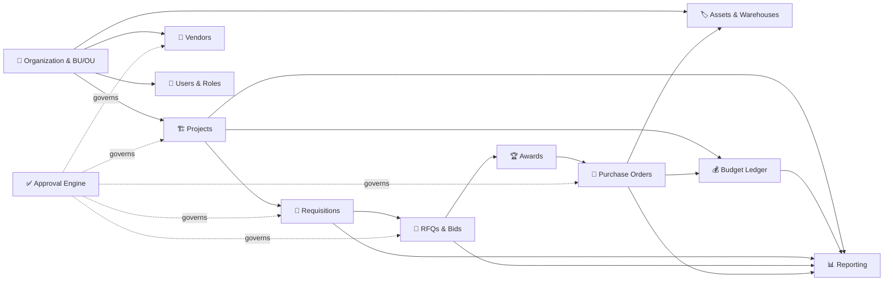
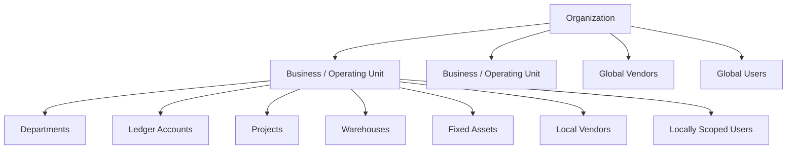
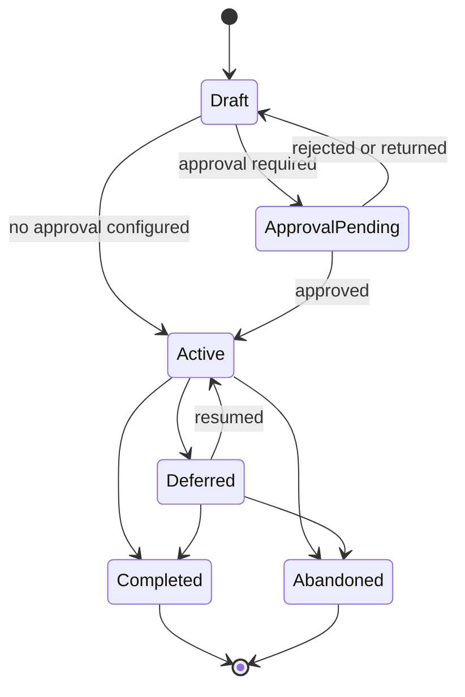
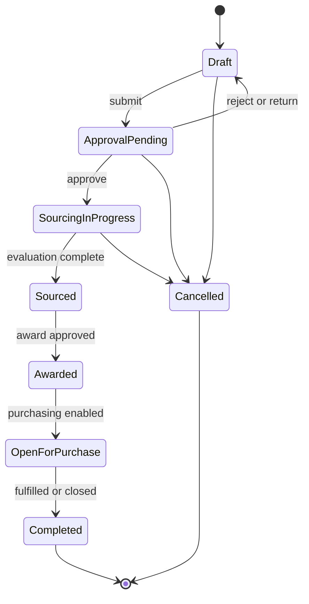
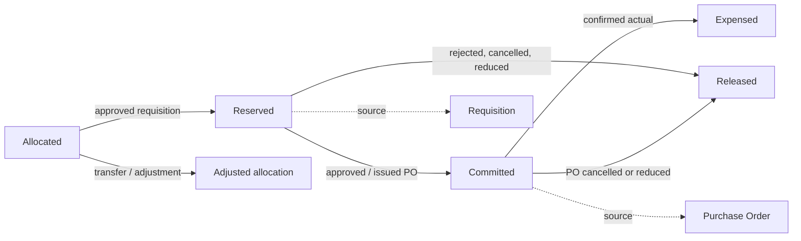
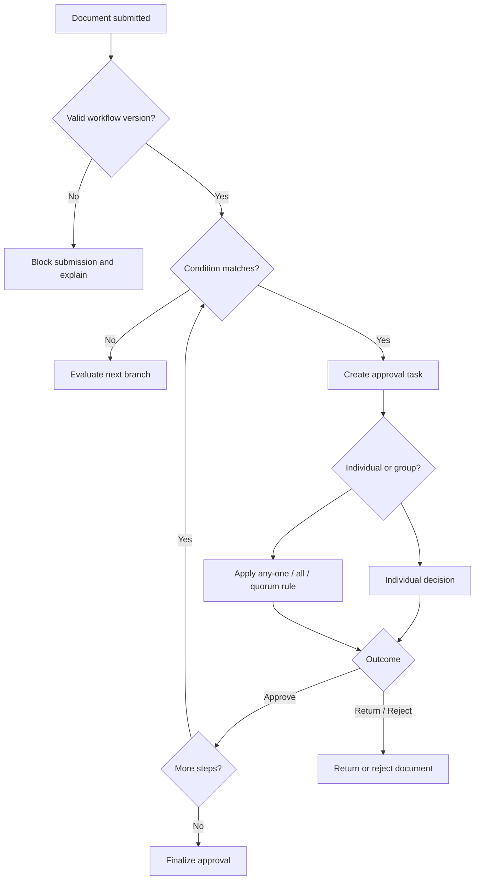
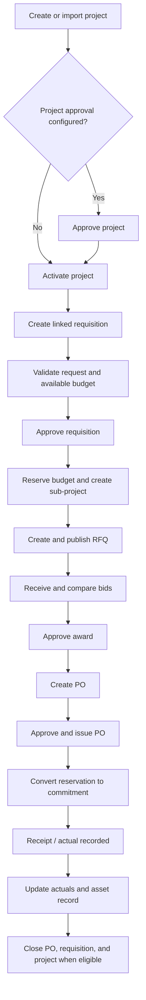
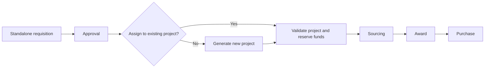
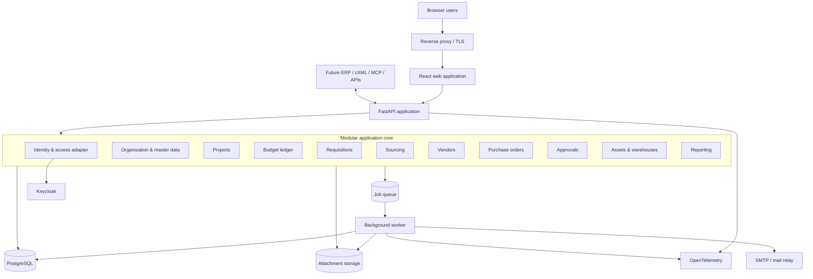

# XLR8 FLO — Product Requirements

> **Product:** Capital Projects, Budget Tracking, and Capital Expenditure Management  
> **Document status:** Working requirements baseline  
> **Last revised:** 24 August 2026  
> **North Star:** *Neutral chrome, chromatic data.* The application shell is quiet grayscale; color appears only where it carries meaning—status, modules, money, and risk.

## 📑 Contents

1. [Purpose and vision](#1--purpose-and-vision)
2. [Goals, scope, and delivery phases](#2--goals-scope-and-delivery-phases)
3. [Users and roles](#3--users-and-roles)
4. [Product modules](#4--product-modules)
5. [Domain model and financial rules](#5--domain-model-and-financial-rules)
6. [Functional requirements](#6--functional-requirements)
7. [End-to-end workflows](#7--end-to-end-workflows)
8. [Reporting and analytics](#8--reporting-and-analytics)
9. [User experience and accessibility](#9--user-experience-and-accessibility)
10. [Security, privacy, and auditability](#10--security-privacy-and-auditability)
11. [Non-functional requirements](#11--non-functional-requirements)
12. [Proposed architecture](#12--proposed-architecture)
13. [Acceptance and quality strategy](#13--acceptance-and-quality-strategy)
14. [Assumptions and open decisions](#14--assumptions-and-open-decisions)
15. [Glossary](#15--glossary)
16. [Standards and research basis](#16--standards-and-research-basis)

---

## 1. 🎯 Purpose and Vision

XLR8 FLO transforms spreadsheet-driven capital planning and procurement into a connected, governed web application. It enables organizations to manage capital projects, funding, requisitions, sourcing, vendors, purchase orders, approvals, assets, and reporting through one traceable system of record.

The product must:

- Replace disconnected Excel workbooks and manual handoffs.
- Show the current financial and operational position of every project.
- Preserve the relationship between a request, its approvals, sourcing activity, purchase commitment, expense, and resulting asset.
- Enforce configurable governance without making routine work cumbersome.
- Give executives summarized KPIs with drill-down to source transactions.
- Provide an API-first foundation for later ERP, supplier-network, cXML, and MCP integrations.

### 1.1 Product principles

| # | Principle | Meaning in practice |
|---:|---|---|
| 1 | **One connected record** | Projects, requisitions, RFQs, bids, awards, POs, assets, budget entries, approvals, notes, and attachments remain linked. |
| 2 | **Trace every amount** | Every balance change is attributable to a dated, authorized transaction. |
| 3 | **Configuration over customization** | Units, workflows, fields, rules, views, and thresholds are configured without forking application code. |
| 4 | **Progressive disclosure** | Tables summarize, side panels reveal, and full pages commit complex changes. |
| 5 | **Secure by default** | Access is least-privilege, scoped by organization and BU/OU, and verified on every protected operation. |
| 6 | **Accessible by design** | Keyboard, screen-reader, contrast, focus, reduced-motion, and non-drag alternatives are acceptance criteria. |

### 1.2 Requirements language

| Term | Meaning |
|---|---|
| **Must** | Required for the stated phase or release acceptance |
| **Should** | Expected unless a documented trade-off is approved |
| **May** | Optional or conditional capability |

Requirement identifiers such as **PROJ-001** are stable references for design, delivery, testing, and traceability.

---

## 2. 🧭 Goals, Scope, and Delivery Phases

### 2.1 Goals

| ID | Goal | Success indicator |
|---|---|---|
| GOAL-001 | Establish a trusted capital-project system of record | Project balances reconcile to their complete transaction history |
| GOAL-002 | Reduce spreadsheet and email dependency | The project-to-PO workflow completes inside XLR8 FLO |
| GOAL-003 | Strengthen financial control | No transaction exceeds authorized funds without an explicit override or adjustment |
| GOAL-004 | Improve sourcing transparency | RFQ invitations, bids, comparisons, decisions, and awards are traceable |
| GOAL-005 | Make governance configurable | Authorized administrators manage approval flows without code changes |
| GOAL-006 | Support executive and operational decisions | KPIs drill down to projects and source transactions |
| GOAL-007 | Minimize software licensing cost | Mandatory components can be self-hosted without a paid software subscription |

### 2.2 Scope by phase

| Capability | Phase 1 — Core web application | Phase 2 — Enterprise controls | Later |
|---|---|---|---|
| Responsive web application | ✅ | Enhance | — |
| Native mobile and desktop applications | — | Evaluate | ✅ |
| Projects and five-level hierarchy | ✅ | Enhance | — |
| Budget allocation, reservation, commitment, actuals, transfers, adjustments | ✅ | Enhance | — |
| Capital requisitions | ✅ | Enhance | — |
| RFQs, bid comparison, and awards | ✅ | Enhance | — |
| Vendor onboarding and records | ✅ | Performance expansion | — |
| Purchase orders by email | ✅ | Change-order maturity | — |
| PO delivery through external APIs and cXML | — | ✅ | Enhance |
| Configurable approval workflow | ✅ | Amount thresholds, delegation, escalation | Enhance |
| Local credentials and password reset | ✅ | Enterprise SSO/federation | Enhance |
| Attachments and notes | ✅ | Retention policies | — |
| Excel/CSV import and Excel/PDF export | ✅ | Scheduled/automated exchange | Enhance |
| Fixed-asset register and basic warehouse inventory | ✅ | Receiving/capitalization maturity | Enhance |
| External API and MCP integrations | Foundation only | Selected integrations | ✅ |

> [!NOTE]
> Goods receipt, invoice matching, supplier self-service, native mobile apps, and advanced asset depreciation are useful extensions but were not in the original core scope. They are later-phase recommendations, not hidden Phase 1 commitments.

### 2.3 Phase 1 non-goals

- Full general-ledger accounting
- Accounts-payable payment processing
- Payroll or human-resources management
- Full warehouse-management or manufacturing functionality
- Statutory tax calculation
- Asset depreciation accounting
- Autonomous AI approval or purchasing decisions
- Mandatory paid SaaS dependencies

---

## 3. 👥 Users and Roles

### 3.1 Baseline roles

| Role | Typical responsibilities |
|---|---|
| **Organization Administrator** | Organization-wide configuration, units, master data, policies, and access |
| **Project Administrator** | Project setup, funding, hierarchy, schedule, risk, and project-level access |
| **Requestor** | Create and track capital requisitions |
| **Approver** | Review assigned documents, decide, and record rationale |
| **Sourcing Specialist** | Create RFQs, manage bids, compare responses, and recommend awards |
| **Purchasing User** | Create, approve, issue, amend, and close purchase orders |
| **Vendor Manager** | Onboard vendors, maintain documents/contacts, and monitor performance |
| **Budget/Finance User** | Allocate, adjust, transfer, reconcile, and report on funds |
| **Warehouse/Asset User** | Maintain warehouses, stock, assignments, and asset records |
| **Executive/Viewer** | Read dashboards and reports within authorized scope |
| **Auditor** | Read configuration, decisions, transaction history, and audit records without changing business data |

### 3.2 Access requirements

| ID | Requirement |
|---|---|
| USR-001 | A user must be assignable globally or to one or more BU/OUs. |
| USR-002 | A user must be able to hold multiple roles, including different roles in different BU/OUs. |
| USR-003 | Access must support organization, BU/OU, module, record, and action scopes. |
| USR-004 | Project-specific view, create, edit, approve, and administrative permissions must be supported. |
| USR-005 | Server-side authorization must be evaluated for every protected request; hidden UI controls are insufficient. |
| USR-006 | Least privilege and default-deny behavior must apply to new roles and permissions. |
| USR-007 | Configurable separation-of-duty rules should prevent incompatible actions, such as requesting and finally approving the same high-value transaction. |
| USR-008 | Role, scope, and permission changes must be effective immediately or on a configured date and must be audited. |
| USR-009 | Deactivating a user must block new sessions without deleting historical attribution. |
| USR-010 | Administrators must be able to inspect a user’s effective access and the source of inherited permissions. |

---

## 4. 🧩 Product Modules

| Module | Purpose | Primary records |
|---|---|---|
| 🏢 **Organization** | Define legal/operating structure and scoped configuration | Organization, BU/OU, department, address, warehouse |
| 🏗️ **Capital Projects** | Plan and monitor projects, phases, risks, budgets, and transactions | Project, sub-project, phase, milestone, risk |
| 🧾 **Capital Requisitions** | Capture and authorize new or project-linked capital needs | Requisition, line item, justification |
| 💰 **Budget Tracking** | Govern funding, reservations, commitments, actuals, adjustments, and transfers | Budget account, ledger entry, transfer |
| 🤝 **Vendor Management** | Onboard, qualify, scope, and evaluate suppliers | Vendor, contact, certificate, questionnaire, score |
| 📣 **Sourcing** | Run RFQs, collect bids, compare offers, and award business | RFQ, invitation, bid, comparison, award |
| 🛒 **Purchase Orders** | Create, approve, issue, amend, and close orders | PO, PO line, transmission, change order |
| ✅ **Approvals** | Configure and execute conditional document approvals | Workflow definition, version, step, decision |
| 🏷️ **Assets and Warehouses** | Track unassigned assets, stock, value, and registration | Warehouse, stock movement, fixed asset |
| 📊 **Reporting** | Serve operational and executive analytics | Dashboard, saved view, report, export |
| ⚙️ **Administration** | Manage users, roles, master data, custom fields, and integrations | User, role, code list, field definition |

### 4.1 Module relationship

## 5. 🧱 Domain Model and Financial Rules

### 5.1 Organization hierarchy

### 5.2 Core relationships

| Parent | Child or related record | Rule |
|---|---|---|
| Organization | BU/OU | One organization may contain multiple uniquely coded units |
| BU/OU | Address | Each unit must have Bill To and Ship To addresses |
| BU/OU | Department / ledger account | Expenses must reference valid scoped codes |
| Project | Sub-project | Up to five project levels are supported |
| Project | Requisition | A requisition may consume an existing project or create one after approval |
| Requisition | RFQ / bid / award | All sourcing records remain linked to the originating requisition |
| Award | Purchase order | A PO may be created only from authorized, sourceable demand |
| Transaction | Budget ledger entry | Every financial effect produces attributable entries |
| Vendor | Contacts / documents / bids / POs | Vendor history remains connected |
| PO / receipt | Fixed asset | Asset-producing purchases can create or update asset records |

### 5.3 Financial vocabulary

| Term | Definition |
|---|---|
| **Allocated budget** | Funds formally assigned to a project or sub-project |
| **Available budget** | Allocated funds less active reservations, commitments, and actuals, adjusted for releases and transfers |
| **Reserved amount** | Funds held when an approved requisition claims budget before a PO exists |
| **Committed amount** | Funds represented by an approved/issued PO or equivalent commitment |
| **Actual expenditure** | Cost recognized from a confirmed downstream transaction or authorized manual actual |
| **Adjustment** | Authorized correction that increases or decreases a balance with a reason |
| **Transfer** | Atomic movement of available funds between eligible projects |

### 5.4 Financial-control requirements

| ID | Requirement |
|---|---|
| FIN-001 | Monetary values must use fixed-precision decimal arithmetic; persisted money must not use binary floating point. |
| FIN-002 | Every monetary amount must carry an ISO 4217 currency code. |
| FIN-003 | A transaction must not mix currencies unless its exchange-rate policy, rate, source, and effective date are recorded. |
| FIN-004 | Posted financial entries must be append-only; corrections use reversal and replacement entries. |
| FIN-005 | Project balances must be derived from and reconcilable to ledger entries. |
| FIN-006 | Budget validation and the corresponding ledger write must occur atomically to prevent concurrent overspend. |
| FIN-007 | Each financial event must record organization, BU/OU, project, department, ledger account, source document, amount, currency, effective date, actor, and timestamp where applicable. |
| FIN-008 | Tax and freight treatment must be independently configurable at organization or BU/OU level. |
| FIN-009 | Rounding mode, currency precision, and line-versus-document rounding rules must be centrally defined and consistently used. |
| FIN-010 | Closing or reopening a financial period must require authorization and create an audit record. |
| FIN-011 | Failed, rejected, cancelled, expired, or reduced transactions must release unused reservations and commitments exactly once. |
| FIN-012 | Retries and duplicate submissions must not create duplicate financial effects. |

---

## 6. ⚙️ Functional Requirements

### 6.1 Organization and master data

| ID | Requirement |
|---|---|
| ORG-001 | An organization must support multiple Business Units and/or Operating Units, each with a unique code. |
| ORG-002 | Approval configuration must be definable organization-wide or per BU/OU, with a documented precedence rule. |
| ORG-003 | Vendor availability must support global and BU/OU-local scope. |
| ORG-004 | User assignment must support global and one-or-more BU/OU scopes. |
| ORG-005 | Each BU/OU must maintain Bill To and Ship To addresses with effective dates. |
| ORG-006 | Each BU/OU must maintain or link to a fixed-asset register. |
| ORG-007 | Each BU/OU may contain multiple warehouses. |
| ORG-008 | Organization and unit configuration changes must retain before/after values in the audit history. |
| ORG-009 | Codes referenced by posted transactions must be deactivated rather than deleted. |
| ORG-010 | Departments, ledger accounts, currencies, units of measure, tax codes, payment terms, and item/service categories must be governed master data. |
| ORG-011 | Master-data records must support effective dates and active/inactive status. |
| ORG-012 | Authorized users must be able to determine which setting applies when organization and BU/OU configurations overlap. |

### 6.2 Capital projects

| ID | Requirement |
|---|---|
| PROJ-001 | Projects must be creatable manually or through a validated import. |
| PROJ-002 | A project must support configurable approval before activation; it must activate automatically when no approval applies. |
| PROJ-003 | Project consumption must be triggered by approved requisition reservations and/or PO commitments. |
| PROJ-004 | Sub-projects must be creatable manually or automatically from a requisition. |
| PROJ-005 | A project hierarchy must support up to five levels. |
| PROJ-006 | A BU/OU setting must select roll-down funding or roll-up aggregation, applied consistently at every level. |
| PROJ-007 | In roll-down mode, a child allocation must not exceed the parent’s available budget. |
| PROJ-008 | In roll-up mode, a parent budget must aggregate descendants without duplicating their funds. |
| PROJ-009 | Project dashboards must visualize hierarchy and drill down to items, services, documents, and ledger entries. |
| PROJ-010 | An organization-level executive dashboard must aggregate projects and drill down by BU/OU. |
| PROJ-011 | Projects may be divided into phased sub-projects with planned items/services for each phase. |
| PROJ-012 | Status must support Draft, Approval Pending, Active, Deferred, Completed, and Abandoned. |
| PROJ-013 | Valid status transitions, permissions, and budget effects must be enforced. |
| PROJ-014 | Every project expense must carry a department and ledger account code. |
| PROJ-015 | Projects must track planned/actual dates, milestones, owner, sponsor, health, and percent complete. |
| PROJ-016 | Projects must maintain risks with likelihood, impact, owner, mitigation, due date, and status. |
| PROJ-017 | Approved changes to scope, dates, and budget must be historically traceable. |
| PROJ-018 | A project with open reservations, commitments, requisitions, or POs must not close without resolution or authorized override. |
| PROJ-019 | Project identifiers must be unique within their configured scope. |
| PROJ-020 | Users must be able to filter, sort, group, search, and save project views. |
| PROJ-021 | Project risk indicators should incorporate requirements, milestone/delivery adherence, budget variance, and manually recorded risks while showing the facts behind each indicator. |

#### Project lifecycle

> [!IMPORTANT]
> The precise Deferred, reopen, and abandonment transition policy remains an open decision; the diagram proposes a complete lifecycle without removing any original status.

### 6.3 Capital requisitions

| ID | Requirement |
|---|---|
| REQ-001 | A requisition may be created against an existing project or as a standalone capital request. |
| REQ-002 | Approval of a project-linked requisition must create a requisition-generated sub-project and reserve its approved amount against the parent. |
| REQ-003 | A requisition must not be created against a sub-project that was itself generated by a requisition. |
| REQ-004 | Approval of a standalone requisition must create a project unless an authorized approver assigns it to an existing project. |
| REQ-005 | The base lifecycle must be Draft → Approval Pending → Sourcing in Progress → Sourced → Awarded → Open for Purchase → Completed. |
| REQ-006 | Requisitions must support explicitly tagged item and service lines. |
| REQ-007 | Line entry must suggest previously requested, sourced, or purchased items/services within the authorized scope. |
| REQ-008 | The catalogue must retain BU/OU scope and vendor sourcing/supply/service history. |
| REQ-009 | RFQs, bids, comparisons, awards, POs, approvals, notes, attachments, and budget entries must remain linked. |
| REQ-010 | A requisition must capture requestor, justification, needed-by date, project/BU/OU, department, ledger account, estimate, currency, lines, attachments, and delivery location. |
| REQ-011 | Submission must validate required fields, active master data, project eligibility, available funds, and approval routing. |
| REQ-012 | Changes after submission must use a controlled return, amendment, or resubmission process and preserve prior values. |
| REQ-013 | Rejected, withdrawn, cancelled, expired, or reduced requisitions must release unused reservation exactly once. |
| REQ-014 | Split sourcing and partial awards must be supported without exceeding approved quantity or amount. |
| REQ-015 | The system must show requested, sourced, awarded, ordered, remaining, and cancelled quantities/amounts per line. |
| REQ-016 | A requisition must not complete while an associated award or PO remains actionable unless an authorized close-out rule permits it. |

#### Requisition lifecycle

### 6.4 Budget tracking

| ID | Requirement |
|---|---|
| BUD-001 | Project dashboards must provide authorized allocation, adjustment, and transfer utilities. |
| BUD-002 | Transfers must be allowed between eligible projects at the same hierarchy level unless policy permits otherwise. |
| BUD-003 | A cross-hierarchy transfer must flow upward through the giver’s ancestors and downward through the recipient’s ancestors. |
| BUD-004 | Entries generated by one transfer must commit atomically and share one transfer identifier. |
| BUD-005 | The ledger must list allocations, reservations, commitments, actuals, releases, reversals, transfers, and adjustments. |
| BUD-006 | Every ledger entry must link to its source document or authorized manual action. |
| BUD-007 | Manual adjustments/transfers require a reason, effective date, supporting evidence when configured, and approval when applicable. |
| BUD-008 | Outgoing changes must not reduce available budget below zero unless an authorized negative-budget policy applies. |
| BUD-009 | Balances must support MTD, QTD, YTD, fiscal-year, life-to-date, and selected ranges. |
| BUD-010 | Fiscal calendars must be configurable by organization. |
| BUD-011 | A user must be able to reconcile a displayed balance to its component entries. |
| BUD-012 | Budget snapshots may be captured for approved baselines and period close. |
| BUD-013 | Recalculation jobs must be idempotent and report discrepancies rather than overwrite posted history. |

### 6.5 Vendor management

| ID | Requirement |
|---|---|
| VEN-001 | The system must maintain a simplified, searchable vendor list for sourcing and PO generation. |
| VEN-002 | Each vendor must support billing and service/delivery contacts; additional typed contacts may be added. |
| VEN-003 | Vendor profiles must store required tax, incorporation, insurance, certification, banking-verification, and other configured documents as protected attachments. |
| VEN-004 | Users must be able to submit a new-vendor onboarding request. |
| VEN-005 | Vendor creation, activation, scope changes, suspension, and reactivation must support approval. |
| VEN-006 | Administrators must be able to configure onboarding questionnaires with typed fields, required answers, weights, and scoring. |
| VEN-007 | Vendor performance must be measurable across quality, pricing, delivery/time adherence, service, and configurable categories. |
| VEN-008 | Vendor availability must be global or restricted to selected BU/OUs. |
| VEN-009 | Global vendors may be locally disabled where policy allows, without deleting global history. |
| VEN-010 | Vendor tax identifiers and other configured unique identifiers must be checked for duplicates. |
| VEN-011 | Required documents must support issue date, expiry date, verification status, reviewer, and expiry notifications. |
| VEN-012 | A vendor that is inactive, suspended, expired, or not approved must not be invited or selected unless policy explicitly permits an authorized override. |
| VEN-013 | Vendor changes must not rewrite the vendor snapshot stored on historical RFQs, awards, or POs. |
| VEN-014 | Sensitive vendor data, including tax and banking information, must receive field-level access control and masking where appropriate. |
| VEN-015 | Performance scores must retain source transaction, scorer, period, rationale, and any dispute/adjustment history. |

### 6.6 Sourcing and RFQs

| ID | Requirement |
|---|---|
| SRC-001 | Sourcing users must be able to create an RFQ from approved requisition lines. |
| SRC-002 | An RFQ must contain items/services, quantities, specifications, delivery requirements, response deadline, terms, attachments, and invited vendors. |
| SRC-003 | The system must prevent sourcing more than the approved open quantity or amount unless the requisition is amended. |
| SRC-004 | RFQs must support Draft, Published, Closed, Under Evaluation, Awarded, and Cancelled states. |
| SRC-005 | RFQ versions and changes after publication must be retained and communicated to all affected invitees. |
| SRC-006 | Vendor responses must capture line prices, currency, tax, freight, lead time, validity, exceptions, attachments, and submission timestamp. |
| SRC-007 | Bids must remain confidential from other vendors and from unauthorized internal users. |
| SRC-008 | Late bids must be blocked or explicitly marked and accepted only through an audited override. |
| SRC-009 | The comparison dashboard must normalize and compare total cost, unit cost, tax, freight, lead time, compliance, vendor score, and configured criteria. |
| SRC-010 | Currency conversion used for comparison must show rate, source, and effective date and must not alter the vendor’s original bid. |
| SRC-011 | Evaluators must be able to score qualitative and quantitative criteria with comments and conflicts-of-interest declarations where configured. |
| SRC-012 | Awards may be split by line or quantity across vendors. |
| SRC-013 | An award must record selected vendor, awarded lines, amount, rationale, evaluator results, exceptions, and approval history. |
| SRC-014 | A non-lowest-price award must require an explicit justification when configured. |
| SRC-015 | All RFQs, responses, comparisons, and awards must remain linked to the requisition. |
| SRC-016 | Award totals must not exceed approved requisition scope or available reserved funds without an approved amendment. |
| SRC-017 | Cancelling or superseding an RFQ/award must preserve the complete history and reconcile its downstream budget effect. |
| SRC-018 | Every expenditure line must complete RFQ sourcing before final award, PO submission, or financial effect unless a future, explicitly approved sourcing-exemption policy is introduced. |

### 6.7 Purchase orders

| ID | Requirement |
|---|---|
| PO-001 | POs must be creatable from approved and sourced requisitions or authorized project items. |
| PO-002 | A PO must include requestor, Bill To, Ship To, vendor, items/services, descriptions, quantities, units, unit prices, currency, taxes, freight, terms, dates, project, department, and ledger accounts. |
| PO-003 | POs must follow a configurable approval workflow before issue. |
| PO-004 | Phase 1 must send approved POs by email and record recipient, time, delivery result, and the exact document version. |
| PO-005 | Later phases must support external REST APIs and cXML without changing the core PO record. |
| PO-006 | PO numbers must be unique within their configured organization/BU/OU sequence. |
| PO-007 | The lifecycle should support Draft, Approval Pending, Approved, Issued, Partially Fulfilled, Fulfilled, Closed, Cancelled, and Superseded. |
| PO-008 | Approval or issue must convert the applicable requisition reservation into a commitment atomically. |
| PO-009 | Partial POs must reduce only the corresponding open requisition quantity and value. |
| PO-010 | Issued POs must be immutable; changes must create a numbered, approved change order/version. |
| PO-011 | A change order must preserve the prior version, identify changed fields/lines, recalculate budget effects, and be reapproved when policy requires. |
| PO-012 | Duplicate clicks, retries, worker retries, and integration retries must not issue or transmit a PO more than once unintentionally. |
| PO-013 | Cancelling or reducing a PO must release the unused commitment exactly once and must not erase its history. |
| PO-014 | Generated PO PDFs must be reproducible from the stored PO snapshot and template version. |
| PO-015 | Failed email/API/cXML transmissions must be visible, retryable, and auditable without duplicating the PO. |
| PO-016 | Tax and freight must follow the applicable BU/OU expense policy and remain separately visible. |
| PO-017 | POs must support notes, terms, supporting attachments, and vendor-facing attachments. Internal-only content must never be included accidentally. |

### 6.8 Approval workflow

| ID | Requirement |
|---|---|
| APR-001 | Authorized administrators must be able to design approvals in a flowchart-style drag-and-drop builder. |
| APR-002 | An accessible non-drag method must provide the same workflow-building operations. |
| APR-003 | Workflows must support Projects, Capital Requisitions, Vendors, RFQs, Awards, POs, budget adjustments/transfers, and configured document types. |
| APR-004 | Approvers must be selectable only from eligible users in the relevant organization/BU/OU scope. |
| APR-005 | Conditions must support any approved document attribute, including name, department, ledger account, amount, currency, category, risk, and custom fields. |
| APR-006 | Workflows must support unlimited logical levels, subject to an operational safeguard against excessive depth. |
| APR-007 | The builder must detect and prevent cycles. |
| APR-008 | The builder must warn about and prevent unintended duplicate approvals. |
| APR-009 | Approval groups must support **any one**, **all**, and configured quorum behavior. |
| APR-010 | Amount thresholds and threshold bands are required in Phase 2. |
| APR-011 | Workflow definitions must be versioned; active documents must retain the workflow version used at submission. |
| APR-012 | Publishing a workflow must validate unreachable steps, missing approvers, invalid fields, cycles, and incomplete branches. |
| APR-013 | Approval actions must include approve, reject, return for changes, comment, and—where authorized—withdraw. |
| APR-014 | Every decision must record actor, acting authority/delegation, timestamp, outcome, comment/rationale, and document version. |
| APR-015 | A document changed in a material way after approval must be resubmitted according to policy. |
| APR-016 | Users must not approve a stale document version. |
| APR-017 | Delegation, out-of-office coverage, reminders, due dates, and escalations should be configurable, without changing historical attribution. |
| APR-018 | Group membership must be snapshotted when an approval task is created, or a documented dynamic-membership rule must apply consistently. |
| APR-019 | A user must be prevented from approving their own request where separation-of-duty policy applies. |
| APR-020 | The system must provide inbox, pending, overdue, completed, and delegated approval views. |
| APR-021 | Approval routing must be explainable: authorized users can see which rule matched and why an approver was selected. |

#### Approval execution

### 6.9 Users, authentication, and profiles

| ID | Requirement |
|---|---|
| AUTH-001 | User profiles must link users to BU/OUs, roles, projects, locale, timezone, and notification preferences. |
| AUTH-002 | Phase 1 must support secure local sign-in and password reset; Phase 2 must support enterprise SSO. |
| AUTH-003 | Password behavior must follow current NIST guidance: allow long passphrases and password-manager paste, block common/compromised values, and avoid arbitrary composition or periodic-rotation rules. |
| AUTH-004 | When used as the only factor, a password must be at least 15 characters; an 8-character minimum may apply when it is part of MFA. |
| AUTH-005 | Passwords must be salted and hashed with an approved, adaptively costly password-hashing scheme. |
| AUTH-006 | MFA must be available and should be mandatory for privileged users; phishing-resistant methods should be preferred. |
| AUTH-007 | Authentication errors must not reveal whether an account exists. |
| AUTH-008 | Password reset tokens must be single-use, short-lived, securely generated, and invalidated after use. |
| AUTH-009 | Session idle and absolute timeouts must be configurable, with reauthentication for sensitive actions. |
| AUTH-010 | Users must be able to view and revoke their active sessions where the identity solution supports it. |
| AUTH-011 | Account activation, suspension, recovery, lockout, and deactivation must be auditable. |
| AUTH-012 | SSO must use established federation protocols such as OpenID Connect or SAML; business authorization remains controlled by XLR8 FLO. |

### 6.10 Warehouses and fixed assets

| ID | Requirement |
|---|---|
| AST-001 | Each BU/OU may create warehouses for unassigned fixed assets and basic stock counts. |
| AST-002 | Warehouses must record locations, custodians, active status, and supported item categories. |
| AST-003 | Stock movements must support receipt, transfer, assignment, return, adjustment, and disposal with actor, time, quantity, reason, and source. |
| AST-004 | Physical assignment of interchangeable stock must use FIFO unless an authorized user records an exception. |
| AST-005 | Perpetual inventory valuation must use weighted average purchase cost. FIFO assignment and weighted-average valuation must remain distinct rules. |
| AST-006 | Stock quantity and value must be derivable from an append-only movement history. |
| AST-007 | Negative stock must be prevented unless an authorized policy explicitly permits it. |
| AST-008 | The fixed-asset register must support asset number, description, category, project, PO/line, purchase cost, currency, acquisition date, location, custodian, serial number, and status. |
| AST-009 | Assignment from warehouse stock to a project, location, or custodian must preserve lineage to the originating purchase. |
| AST-010 | Stock-count adjustments must require reason and approval when configured. |
| AST-011 | Phase 2 should support goods receipt, inspection, capitalization handoff, and partial delivery. |
| AST-012 | Advanced depreciation and general-ledger posting are outside Phase 1 but may be integrated later. |

### 6.11 Notes, attachments, and collaboration

| ID | Requirement |
|---|---|
| COL-001 | All business documents must support timestamped notes and attachments. |
| COL-002 | Notes must identify author and visibility, including internal-only versus externally shareable. |
| COL-003 | Edited notes should preserve edit history; notes used as approval rationale must be immutable. |
| COL-004 | Attachments must retain original filename, generated storage key, media type, size, checksum, uploader, upload time, scan status, and linked record. |
| COL-005 | Uploads must use allow-listed extensions/types, content and signature validation, safe filenames, size limits, access control, and malware scanning. |
| COL-006 | Files must be stored outside the public web root and downloaded through an authorized, time-limited path or application response. |
| COL-007 | Quarantined, rejected, or unscanned files must not be available to ordinary users or external recipients. |
| COL-008 | Attachment versions, deletion/retention actions, downloads of sensitive files, and external sharing must be audited. |
| COL-009 | Mentions, subscriptions, and notifications should be supported without exposing records to unauthorized recipients. |

### 6.12 Custom fields and business rules

| ID | Requirement |
|---|---|
| CUS-001 | Authorized administrators must be able to add typed custom fields to supported document types without a code deployment. |
| CUS-002 | Field types must include text, number, money, date/time, boolean, single/multi-select, and reference where feasible. |
| CUS-003 | Definitions must support label, help text, required status, default, validation, scope, effective dates, display order, and permissions. |
| CUS-004 | A project custom field may flow into downstream transactions according to an explicit propagation rule. |
| CUS-005 | A custom field may be calculated or populated by an approved rule. |
| CUS-006 | Rule evaluation must be deterministic, versioned, auditable, and protected against cycles. |
| CUS-007 | Changing a definition must not reinterpret historical values silently. |
| CUS-008 | Sensitive custom fields must support field-level authorization and exclusion from exports/logs. |
| CUS-009 | Searchable/reportable custom fields must be identified so appropriate indexing or reporting structures can be created. |
| CUS-010 | Deleting a field with historical values must be prohibited; it may be retired and hidden from new entry. |

### 6.13 Import, export, and data portability

| ID | Requirement |
|---|---|
| IMP-001 | The system must support robust Excel and CSV imports aligned to the application’s data model. |
| IMP-002 | Import templates must declare required columns, data types, accepted codes, examples, and template version. |
| IMP-003 | A mapping step must allow source columns to map to fields, including approved custom fields. |
| IMP-004 | Imports must validate file structure, formulas/macros policy, types, references, permissions, duplicates, and business rules before commit. |
| IMP-005 | Users must receive row/column-level errors and a downloadable error report. |
| IMP-006 | A dry-run preview must show creates, updates, skips, warnings, and errors before commit. |
| IMP-007 | The committed batch must be atomic where practical, or explicitly report partial outcomes with recovery instructions. |
| IMP-008 | Imports must be idempotent when a documented external key or batch key is reused. |
| IMP-009 | Each batch must retain uploader, time, file checksum, mapping/template version, counts, result, and resulting record identifiers. |
| IMP-010 | Exports must respect the user’s authorization, active filters, field-level restrictions, locale, timezone, and data-retention policy. |
| IMP-011 | Operational and executive reports must export to HTML, PDF, and Excel. |
| IMP-012 | Large imports and exports must run asynchronously with progress, cancellation where safe, and completion/failure notification. |

### 6.14 Search, notifications, and preferences

| ID | Requirement |
|---|---|
| XFN-001 | Global search must return only authorized records and support key identifiers, names, vendor, project, and document numbers. |
| XFN-002 | Module grids must support sorting, filtering, resizing, reordering, visibility, pinning where useful, pagination/virtualization, and saved views. |
| XFN-003 | Grid and dashboard preferences must be saved per user without altering shared records. |
| XFN-004 | Users must be able to configure a home dashboard using saved views and permitted cards. |
| XFN-005 | Notifications must support in-app and email channels with configurable event preferences, except mandatory security/administrative notices. |
| XFN-006 | Approval, due-date, document-expiry, failed-transmission, import/export, and material project-risk events must be eligible for notification. |
| XFN-007 | Notifications must link to the relevant authorized record and must not expose sensitive content in subject lines or lock-screen previews. |
| XFN-008 | Every screen must provide contextual field help through accessible tooltips or equivalent help text. |
| XFN-009 | Foreign-key fields such as department, ledger account, vendor, project, and item must use scoped dropdown/type-ahead selection rather than free text. |
| XFN-010 | A command palette should provide keyboard-first navigation and permitted actions. |

---

## 7. 🔄 End-to-End Workflows

### 7.1 Project-to-purchase workflow

### 7.2 Standalone requisition workflow

### 7.3 Cross-hierarchy budget transfer

The transfer must:

1. Validate source availability and source/target eligibility.
2. Resolve the complete source and target ancestry.
3. Generate balanced, linked ledger entries for every affected level.
4. Commit all entries or none.
5. Record reason, requester, approvers, effective date, and evidence.
6. Notify affected project owners where configured.

### 7.4 Workflow invariants

| ID | Invariant |
|---|---|
| WF-001 | A downstream record must never be created from an unauthorized or stale upstream version. |
| WF-002 | A status transition must validate actor, current state, required fields, approvals, and financial side effects. |
| WF-003 | The document transition and its financial entries must commit atomically. |
| WF-004 | Retrying a workflow command must return the existing outcome or safely continue; it must not duplicate records or amounts. |
| WF-005 | Cancellation must propagate only through defined relationships and must never erase history. |
| WF-006 | Users must receive a clear, actionable explanation when a workflow action is blocked. |

---

## 8. 📊 Reporting and Analytics

### 8.1 Reporting audiences

| Audience | Primary needs |
|---|---|
| **Executive** | Portfolio health, total budget, available/committed/actual, forecast, risk, variance, and BU/OU comparison |
| **Project operations** | Schedule, milestones, requisitions, sourcing progress, commitments, actuals, and risks |
| **Finance** | Ledger reconciliation, movements, period activity, exceptions, and department/account analysis |
| **Sourcing/purchasing** | Cycle time, savings, bid coverage, award reasons, PO status, and transmission failures |
| **Vendor management** | Onboarding status, expiring documents, spend, delivery, quality, and performance trends |
| **Audit** | Actor-attributed changes, approvals, overrides, exports, configuration versions, and transaction lineage |

### 8.2 Reporting requirements

| ID | Requirement |
|---|---|
| RPT-001 | Executive and operational reporting must be clearly separated while sharing governed definitions. |
| RPT-002 | Dashboards must support organization → BU/OU → project → sub-project → document → transaction drill-down. |
| RPT-003 | Project reporting must show allocation, reservation, commitment, actual, available balance, variance, and consumption percentage. |
| RPT-004 | Time analysis must support year, fiscal period, quarter, month, week, and selected date range. |
| RPT-005 | Charts must be interactive and customizable within user permissions. |
| RPT-006 | Every KPI must have a documented definition, source, calculation, time basis, currency basis, and refresh time. |
| RPT-007 | Dashboard totals must reconcile to exported detail under the same filters and as-of time. |
| RPT-008 | Users must be able to save personal views; authorized users may publish governed shared views. |
| RPT-009 | Reports must support HTML, PDF, and Excel output. |
| RPT-010 | Exports must include report name, filters, scope, generation time, timezone, currency context, and page numbering where relevant. |
| RPT-011 | Long reports must run asynchronously and must not block normal transactional work. |
| RPT-012 | Reports must enforce row- and field-level authorization at query time. |
| RPT-013 | Accessible data tables or summaries must accompany charts so information is not conveyed only visually. |
| RPT-014 | Materialized summaries or cached results must display their as-of time and refresh status. |

### 8.3 Recommended KPIs

| Domain | KPI examples |
|---|---|
| Projects | Active/deferred count, on-time percentage, schedule variance, budget variance, risk exposure |
| Budget | Allocated, reserved, committed, actual, available, utilization, transfer/adjustment volume |
| Requisitions | Approval cycle time, sourcing lead time, open aging, rejection/return rate |
| Sourcing | Vendors invited/responding, bid coverage, award cycle time, quoted-versus-awarded savings |
| Purchase orders | Approval time, issue success, open commitment, fulfillment status, change-order rate |
| Vendors | Onboarding duration, document compliance, quality, delivery adherence, pricing trend |

---

## 9. 🎨 User Experience and Accessibility

### 9.1 Design principles

| # | Principle | What it means in practice |
|---:|---|---|
| 1 | **Calm density** | Show a lot, shout nothing. Establish hierarchy through typography, whitespace, and 1 px lines—not loud color blocks. |
| 2 | **Keyboard is the fastest path** | Every screen and action is keyboard reachable. ⌘K/Ctrl+K opens immediately; keyboard-initiated actions avoid unnecessary animation. |
| 3 | **Color earns its place** | Each module owns one accent hue and each state one semantic hue. If color does not inform, use grayscale. |
| 4 | **Motion explains** | Animate spatial relationships, state changes, and cause/effect—not decoration. UI transitions should stay under 300 ms. |
| 5 | **Two clicks to common work** | Frequent create, convert, approve, and navigation tasks should take no more than two intentional actions from an appropriate starting context. |
| 6 | **Progressive disclosure** | Tables summarize, side sheets reveal, and pages commit. Complexity unfolds on demand. |
| 7 | **Respect the operator** | Visible focus, AA contrast, reduced motion, meaningful errors, and undo instead of confirmation where recovery is safe. |
| 8 | **Purposeful feedback** | Use lightweight motion, skeleton loading, animated charts, and contextual tooltips while avoiding distraction or misleading progress. |

### 9.2 Accessibility requirements

| ID | Requirement |
|---|---|
| A11Y-001 | The responsive web application must conform to WCAG 2.2 Level AA across complete supported workflows. |
| A11Y-002 | All functions must be operable by keyboard with visible, unobscured focus and logical focus order. |
| A11Y-003 | Drag-and-drop interactions must have an equivalent non-drag control. |
| A11Y-004 | Color must not be the only way to communicate status, risk, validation, or financial direction. |
| A11Y-005 | Text, controls, focus indicators, and non-text UI must meet applicable contrast requirements. |
| A11Y-006 | Forms must have programmatic labels, instructions, field-level errors, an error summary, and preserved input after validation failure. |
| A11Y-007 | Status updates, asynchronous completion, and validation changes must be announced appropriately to assistive technologies. |
| A11Y-008 | Grids must expose meaningful table/grid semantics and offer efficient keyboard navigation. |
| A11Y-009 | Charts must have names, descriptions, and equivalent tabular or textual data. |
| A11Y-010 | The application must honor reduced-motion preferences; core information must not depend on animation. |
| A11Y-011 | Touch targets, zoom/reflow, orientation, and responsive states must meet WCAG 2.2 requirements. |
| A11Y-012 | Authentication must support password managers and accessible authentication without cognitive-function tests. |

### 9.3 Interaction requirements

| ID | Requirement |
|---|---|
| UX-001 | The UI must provide consistent navigation, breadcrumbs, page titles, action placement, and terminology. |
| UX-002 | Destructive or irreversible actions must identify consequences and target; reversible actions should offer undo where safe. |
| UX-003 | Unsaved changes must be detected before accidental navigation. |
| UX-004 | Loading states must distinguish initial loading, incremental loading, empty results, and failure. |
| UX-005 | Errors must state what happened, what was preserved, and how the user can recover. |
| UX-006 | Light and dark modes must be supported without weakening semantic color or contrast. |
| UX-007 | Dates, numbers, and currencies must display in the user’s locale while preserving canonical stored values. |
| UX-008 | Desktop web is the primary Phase 1 target, but essential workflows must remain usable on common tablet and mobile browser widths. |
| UX-009 | Role-based onboarding must introduce essential navigation, terminology, and first tasks without blocking experienced users. |
| UX-010 | Contextual help, quick-start guidance, and administrator/operator documentation must support lean training and self-service adoption. |

---

## 10. 🔐 Security, Privacy, and Auditability

### 10.1 Security baseline

| ID | Requirement |
|---|---|
| SEC-001 | The application should be designed and verified against OWASP ASVS 5.0 Level 2 or an approved equivalent baseline. |
| SEC-002 | Threat models must cover authentication, authorization, multi-tenancy/scope, financial business logic, imports, uploads, integrations, and administrative functions. |
| SEC-003 | All external traffic must use authenticated TLS; insecure transport must redirect or fail closed as appropriate. |
| SEC-004 | Sensitive data must be encrypted at rest where threat, regulation, or organizational policy requires it. |
| SEC-005 | Secrets must not be stored in source code, browser bundles, logs, or ordinary configuration files. |
| SEC-006 | Input must be allow-list validated at trust boundaries, and database access must use parameterized queries. |
| SEC-007 | Output must be contextually encoded; browser protections such as CSP, secure cookies, CSRF defense, clickjacking defense, and strict transport policy must be configured. |
| SEC-008 | Authorization must prevent cross-organization, cross-BU/OU, cross-project, and object-identifier access. |
| SEC-009 | High-risk actions must support step-up authentication or recent-authentication checks. |
| SEC-010 | Authentication, recovery, import, export, search, and integration endpoints must have abuse-aware throttling. |
| SEC-011 | User-visible errors and API errors must not expose secrets, queries, stack traces, filesystem paths, or internal topology. |
| SEC-012 | Dependency scanning, secret scanning, static analysis, dynamic testing, and an SBOM must be part of release controls. |
| SEC-013 | Supported dependencies and container images must be patched under a documented vulnerability-response SLA. |
| SEC-014 | Production administrative access must be restricted, attributable, time-bounded where possible, and logged. |

### 10.2 Business audit trail

The business audit trail and security/operational logs serve different purposes and must remain distinguishable.

| ID | Requirement |
|---|---|
| AUD-001 | Create, update, transition, approval, rejection, override, import, export, transmission, configuration, and deletion/retirement events must be audited. |
| AUD-002 | Each audit event must record when, where, who, what, target, action, outcome, reason, correlation identifier, and before/after values where appropriate. |
| AUD-003 | Audit timestamps must be stored in UTC with sufficient precision and displayed in the viewer’s timezone. |
| AUD-004 | Audit records must be append-only for application users and protected from unauthorized modification or deletion. |
| AUD-005 | Audit access must itself be restricted and audited. |
| AUD-006 | Secrets, passwords, raw tokens, session identifiers, sensitive banking data, and unnecessary personal information must not be written to logs. |
| AUD-007 | Financial events must retain immutable lineage from project balance to source document and approval. |
| AUD-008 | Audit retention and legal hold must be configurable according to organizational and jurisdictional policy. |
| AUD-009 | Audit records must be searchable/exportable by authorized auditors without changing the source data. |
| AUD-010 | System clocks must be synchronized, and event correlation identifiers must span API and background processing. |

### 10.3 Privacy and retention

| ID | Requirement |
|---|---|
| PRIV-001 | Collect only personal and sensitive data required for stated business purposes. |
| PRIV-002 | Data classes, owners, retention periods, and deletion/archive behavior must be documented. |
| PRIV-003 | Record deletion must honor financial/audit retention and legal holds; de-identification should be used where history must remain. |
| PRIV-004 | Production data must not be copied to non-production environments without authorization and protection/de-identification. |
| PRIV-005 | Data exports and sensitive-record access must be attributable and subject to authorization. |
| PRIV-006 | Backup expiry and deletion must align with the approved retention policy. |

---

## 11. 🛡️ Non-Functional Requirements

### 11.1 Performance and scale

The numerical targets below are proposed acceptance baselines and must be calibrated against expected volumes.

| ID | Proposed target |
|---|---|
| PERF-001 | At the agreed reference load, 95% of ordinary interactive API requests should complete within 500 ms, excluding network latency and asynchronous work. |
| PERF-002 | Search and common grid queries should return the first useful page within 2 seconds at reference volume. |
| PERF-003 | Ordinary dashboard views should become usable within 3 seconds when summaries are current. |
| PERF-004 | Imports, complex reports, bulk exports, email delivery, and recalculation must run as background jobs with visible progress. |
| PERF-005 | Pagination, server-side filtering, and/or virtualization must prevent large datasets from being loaded into the browser unnecessarily. |
| PERF-006 | Reference data volumes, concurrency, peak transactions, file sizes, report sizes, and growth rate must be agreed before performance acceptance. |

### 11.2 Availability, continuity, and recovery

| ID | Requirement |
|---|---|
| REL-001 | Proposed Phase 1 service availability is 99.5% per month, excluding announced maintenance; the final target requires approval. |
| REL-002 | Transactional operations must fail atomically and return an actionable error or a safely retryable status. |
| REL-003 | Health/readiness checks must distinguish process health from dependency readiness. |
| REL-004 | Database and attachment backups must be automated, encrypted, monitored, and retained under policy. |
| REL-005 | Proposed Phase 1 targets are RPO ≤ 24 hours and RTO ≤ 8 hours; final targets depend on business impact analysis. |
| REL-006 | Restore procedures must be tested at least quarterly, and evidence of successful restoration must be retained. |
| REL-007 | Background jobs must retry transient failures with bounded backoff and route exhausted failures for operator review. |
| REL-008 | Database schema changes must support tested backup/restore and rollback or forward-repair procedures. |

### 11.3 Data integrity and concurrency

| ID | Requirement |
|---|---|
| DATA-001 | Foreign keys, uniqueness, check constraints, and transactions must enforce critical invariants in the database as well as the application. |
| DATA-002 | Concurrent edits must use optimistic concurrency or equivalent version checks; stale writes must not silently overwrite newer data. |
| DATA-003 | Financial and workflow commands must accept an idempotency key where retries are plausible. |
| DATA-004 | Time must be stored in UTC; business-effective dates and originating timezone must be retained where relevant. |
| DATA-005 | Historical documents must retain snapshots of mutable referenced data needed to reproduce their legal/business meaning. |
| DATA-006 | Data migrations must be repeatable, observable, tested on representative volumes, and reconciled. |

### 11.4 Compatibility and portability

| ID | Requirement |
|---|---|
| COMP-001 | The web application must support the latest two stable major versions of Chrome, Edge, Firefox, and Safari unless an enterprise browser policy says otherwise. |
| COMP-002 | APIs and exports must use documented, non-proprietary formats where practical. |
| COMP-003 | The mandatory stack must be operable without a paid software licence or required SaaS subscription. |
| COMP-004 | Deployments must externalize configuration and avoid environment-specific code branches. |
| COMP-005 | The organization must be able to export its business data and attachments in documented formats. |

### 11.5 Observability and supportability

| ID | Requirement |
|---|---|
| OBS-001 | Services must emit structured logs, metrics, and traces with correlation identifiers using vendor-neutral instrumentation. |
| OBS-002 | Monitoring must cover availability, latency, errors, saturation, job backlog/failures, database health, storage, email/integration delivery, and backup results. |
| OBS-003 | Alerts must be actionable, severity-classified, routed to an owner, and linked to runbooks. |
| OBS-004 | Business monitoring must expose stuck approvals, unreconciled balances, expired vendor documents, and failed transmissions. |
| OBS-005 | Log verbosity may be configurable, but mandatory audit/security events must not be disabled. |
| OBS-006 | Support users must be able to use a correlation identifier without receiving unauthorized business data. |

---

## 12. 🏛️ Proposed Architecture

> [!IMPORTANT]
> This is a **proposed architecture for discussion**. It satisfies the “no required paid software subscription” constraint, but choices remain subject to approval through `docs/codex-plan.md`.

### 12.1 Cost boundary

All mandatory software components should be open-source or otherwise free for commercial self-hosting. This avoids required software subscriptions, but production operation may still incur compute, storage, domain, mail, backup, network, and support costs unless existing infrastructure is used.

### 12.2 Architecture style: modular monolith

Use one deployable backend divided into strongly bounded business modules. Each module owns its services and data-access boundary; cross-module work occurs through explicit interfaces and domain events.

| Pros | Cons / controls |
|---|---|
| Lower development and operating complexity than microservices | Boundaries require architectural tests and code-review discipline |
| Straightforward atomic transactions across budgets, requisitions, and POs | Backend modules normally deploy together |
| Easier end-to-end audit consistency | Heavy reports need asynchronous work, indexes, and summaries |
| Simple local development and initial deployment | Modules cannot scale independently until extracted |
| Modules may be extracted later when evidence justifies it | A poorly structured monolith can become tightly coupled |

Microservices are not recommended initially because core operations are strongly related and transactional. Distributed services would introduce message delivery, consistency, network-failure, and observability costs before providing a demonstrated benefit.

### 12.3 Logical architecture

### 12.4 Proposed technology stack

| Layer | Proposed technology | Rationale | Required subscription |
|---|---|---|---:|
| Architecture | Modular monolith | Transaction integrity with low operational overhead | No |
| Web UI | React + TypeScript + Vite | Strong ecosystem for dense forms, grids, dashboards, and keyboard UX | No |
| Styling/components | Tailwind CSS plus application-owned accessible components | Full visual control without a proprietary theme | No |
| Data grids | TanStack Table with virtualization | Rich grid behavior with controlled server state | No |
| Charts | Apache ECharts | Interactive Canvas/SVG charts | No |
| API | Python + FastAPI | Typed APIs and strong spreadsheet/reporting ecosystem | No |
| Validation | Pydantic | Consistent API parsing and validation | No |
| Persistence | PostgreSQL + SQLAlchemy + Alembic | Transactions, constraints, recursive hierarchies, JSON, migrations | No |
| Authentication | Self-hosted Keycloak | Local identity initially and SSO/federation later | No |
| Jobs | PostgreSQL-backed queue initially | Avoids an extra broker until throughput proves a need | No |
| Attachments | Protected filesystem behind a storage abstraction initially | Simple first deployment and future object-storage migration | No |
| Email | Standard SMTP adapter | Existing mail server or later provider | No software subscription |
| API contract | OpenAPI 3.1+ and RFC 9457 problem details | Machine-readable contract and consistent errors | No |
| Documents | HTML + Playwright PDF; open-source XLSX tooling | Reproducible PDF/Excel without office automation | No |
| Observability | OpenTelemetry; optional Prometheus/Grafana-compatible backend | Vendor-neutral telemetry | No |
| Testing | Pytest + Playwright + accessibility automation | Unit, integration, browser, and accessibility coverage | No |
| Runtime | OCI containers with Podman on Linux | Reproducible deployment without Docker Desktop dependency | No |

### 12.5 Major decision trade-offs

#### React + TypeScript + Vite

| Pros | Cons |
|---|---|
| Excellent enterprise UI ecosystem and strong typing | Requires clear component/state conventions |
| Flexible styling for the “neutral chrome” design | Advanced grids must be composed rather than purchased |
| Vite avoids coupling to one server/host | Accessibility of custom interactions must be actively tested |

**Alternative:** Angular offers stronger built-in conventions but more ceremony and less freedom for a bespoke UI.

#### FastAPI

| Pros | Cons |
|---|---|
| Strong Excel/CSV, analytics, and reporting ecosystem | Frontend and backend use different languages |
| Typed validation and generated OpenAPI | Static typing requires disciplined enforcement |
| Fast delivery for rules-heavy APIs | CPU-heavy work must move to workers |

**Alternative:** NestJS gives end-to-end TypeScript and strong structure; Python is favored for ingestion, finance-oriented processing, and reporting.

#### PostgreSQL

| Pros | Cons |
|---|---|
| Transactions and relational integrity fit financial controls | Requires backup, upgrade, and tuning ownership |
| Recursive queries support project hierarchies | Custom-field/report queries require deliberate design |
| JSON supports controlled extension without abandoning relations | Heavy analytics may eventually need replicas or materialized models |

**Alternative:** A document database offers flexible shapes but is a weaker primary choice for related financial and approval records.

#### Keycloak

| Pros | Cons |
|---|---|
| Avoids bespoke password/session implementation | Adds a service to operate and upgrade |
| Enables later OIDC/SAML federation | Local development is heavier |
| Central password, MFA, and session policies | Business roles must be separated from identity roles |

**Alternative:** Application-native authentication reduces initial infrastructure but increases security responsibility and SSO migration cost.

#### Podman and a single Linux host

| Pros | Cons |
|---|---|
| Reproducible, subscription-free container workflow | Initial topology has limited high availability |
| Simple deployment and recovery model | Team owns TLS, patching, monitoring, and backups |
| Future orchestrator migration remains possible | Some Docker-centric tooling needs adaptation |

**Alternative:** Kubernetes provides orchestration and scale but adds disproportionate complexity to the first deployment.

### 12.6 Module boundaries

| Module | Owns | May consume |
|---|---|---|
| Organization | Units, addresses, scoped configuration, master data | Identity references |
| Projects | Hierarchy, phases, milestones, risks, status | Organization, budget summaries |
| Budget | Ledger, balances, transfers, adjustments, periods | Project/document identifiers |
| Requisitions | Request header/lines, status, generated-project link | Projects, catalogue, budget commands |
| Sourcing | RFQs, invitations, bids, comparisons, awards | Requisition scope, vendors |
| Vendors | Profiles, contacts, documents, questionnaires, scores | Organization scope |
| Purchase orders | PO snapshots, versions, transmissions | Awards, vendors, budget commands |
| Approvals | Definitions, versions, tasks, decisions | Read-only document facts and identity |
| Assets | Warehouses, stock movements, asset register | PO/receipt references |
| Reporting | Read models, governed KPI definitions | Authorized projections from all modules |

Modules must not update another module’s tables directly. Cross-module changes must use an application interface in the same transaction or a durable event where eventual consistency is acceptable.

### 12.7 Data and integration architecture

| ID | Requirement |
|---|---|
| ARCH-001 | PostgreSQL is the transactional system of record. |
| ARCH-002 | Business modules should use separate schemas or clearly enforced ownership conventions. |
| ARCH-003 | The budget ledger, stock movement history, audit trail, and approval decisions are append-only records. |
| ARCH-004 | Read-optimized views and materialized summaries may be rebuilt from authoritative records. |
| ARCH-005 | Attachment metadata belongs in PostgreSQL; file bytes remain behind a storage abstraction. |
| ARCH-006 | External effects such as email/API delivery must use a transactional outbox or equivalent durable handoff. |
| ARCH-007 | APIs must be versioned, documented with OpenAPI, and return RFC 9457-compatible problem details. |
| ARCH-008 | API pagination, filtering, sorting, expansion, rate limits, and deprecation policy must be consistent and documented. |
| ARCH-009 | Webhooks/inbound integrations must authenticate, validate, rate limit, retain correlation/idempotency keys, and prevent replay. |
| ARCH-010 | cXML and external formats must be mapped at integration boundaries, not used as the internal domain model. |
| ARCH-011 | The application must remain functional without an external analytics, federation, or object-storage subscription. |

---

## 13. ✅ Acceptance and Quality Strategy

### 13.1 Definition of done

A requirement is complete only when:

1. Acceptance criteria and applicable edge cases are implemented.
2. Authorization, audit, accessibility, and error behavior are covered.
3. Automated tests pass at the appropriate levels.
4. Database migrations and rollback/forward-repair procedures are reviewed.
5. Logs, metrics, alerts, and operational documentation are present where needed.
6. User-facing help and field tooltips are updated.
7. No unresolved critical/high security defect remains without explicit risk acceptance.
8. Requirements-to-test traceability is recorded.

### 13.2 Test coverage

| Test type | Required coverage |
|---|---|
| Unit | Financial calculations, state transitions, conditions, custom rules, validation |
| Database/integration | Constraints, concurrency, transactions, migrations, access scope |
| API contract | OpenAPI conformance, errors, pagination, authorization, idempotency |
| End-to-end | Critical project → requisition → RFQ → award → PO → budget workflows |
| Accessibility | Automated checks plus keyboard and assistive-technology review of critical paths |
| Security | ASVS-based verification, dependency/secret/static/dynamic scanning, penetration testing before production |
| Performance | Reference-volume grids, dashboards, concurrent budget use, imports, reports |
| Resilience | Worker retry, mail/API failure, database/storage loss, backup restoration |
| Reconciliation | Balances, transfers, hierarchy roll-up/down, PO changes, cancellation/release |

### 13.3 Critical acceptance scenarios

| ID | Scenario |
|---|---|
| ACC-001 | Two concurrent requisitions cannot reserve more than the same project’s available budget. |
| ACC-002 | Retrying an approved transfer or PO issue cannot duplicate ledger entries or vendor transmission. |
| ACC-003 | Every dashboard balance drills down to a ledger that recalculates to the same value. |
| ACC-004 | A user cannot access another BU/OU’s record by guessing an identifier or changing a request. |
| ACC-005 | Changing an issued PO creates a new version/change order and preserves the vendor-sent snapshot. |
| ACC-006 | Cancelling a requisition or PO releases only its unused funds, once. |
| ACC-007 | Editing a workflow does not alter the routing or decision history of documents already submitted. |
| ACC-008 | A complete project-to-PO workflow is operable without a mouse. |
| ACC-009 | A malicious or disallowed attachment is quarantined/rejected and cannot be downloaded. |
| ACC-010 | Restoring database and attachment backups produces a consistent, reconcilable system. |

---

## 14. ❓ Assumptions and Open Decisions

These items are explicit so implementation does not silently select a business rule.

| # | Topic | Current proposed interpretation | Decision required |
|---:|---|---|---|
| 1 | Cost constraint | No mandatory paid licence/SaaS; infrastructure may still cost money | Confirm |
| 2 | Project roll mode | Configured per BU/OU and inherited by projects | Confirm organization/project overrides |
| 3 | Deferred project | May resume, complete, or abandon after resolving open activity | Confirm transitions |
| 4 | Requisition-generated sub-project | May not receive another requisition | Confirm transfers/manual expenses |
| 5 | Budget lifecycle | Approval reserves; approved/issued PO commits; confirmed actual expenses | Confirm recognition events |
| 6 | Tax/freight | Independent BU/OU settings and separately visible totals | Confirm document-type variation |
| 7 | Cross-hierarchy transfer | One atomic transaction with entries through both ancestries | Confirm eligibility/approval |
| 8 | Multi-currency | Original currency plus explicit conversion context | Define currencies/rate source |
| 9 | Approval rejection | Return to Draft by default; final rejection available by policy | Confirm |
| 10 | Approval membership | Snapshot group membership when a task is created | Confirm |
| 11 | Approval depth | Logically unlimited with a configurable operational limit | Define safe limit |
| 12 | Vendor scope | A global vendor may be locally disabled but not rewritten | Confirm |
| 13 | Inventory | FIFO for physical assignment; weighted average for valuation | Confirm |
| 14 | Actual expenditure | Requires receipt, invoice, or authorized manual actual source | Select Phase 1 source |
| 15 | SSO | Keycloak handles Phase 1 local identity; federation arrives in Phase 2 | Approve architecture |
| 16 | Availability/recovery | 99.5% availability, RPO 24h, RTO 8h | Validate by business impact |
| 17 | Retention | Configurable; no default period assumed | Define per record class/jurisdiction |
| 18 | Data volumes | Not yet supplied | Define users, projects, lines, files, concurrency, growth |
| 19 | Threshold approvals | Phase 2 per original scope | Confirm any Phase 1 amount routing |
| 20 | Goods receipt/invoices | Goods receipt recommended Phase 2; AP/payment outside core | Confirm roadmap |

### 14.1 Original capability preservation

| Original area | Location in this document |
|---|---|
| Capital Projects | Sections 4, 6.2, 7.1, 8 |
| Capital Expenditure/Requisitions | Sections 6.3, 7.1–7.2 |
| Budget Tracking | Sections 5.3–5.4, 6.4, 7.3 |
| Vendor Management | Section 6.5 |
| Sourcing/RFQs | Section 6.6 |
| Purchase Orders, email/API/cXML | Sections 6.7, 12.7 |
| Approvals and workflow builder | Section 6.8 |
| Users, roles, BU/OU access, passwords, SSO | Sections 3, 6.9 |
| Organization, addresses, fixed assets, warehouses | Sections 5.1, 6.1, 6.10 |
| Notes and attachments | Section 6.11 |
| Custom fields/rules | Section 6.12 |
| Excel/CSV ingestion | Section 6.13 |
| Executive/operational reporting and formats | Section 8 |
| Grids, saved views, charts, tooltips, themes | Sections 6.14, 8, 9 |
| Design principles and motion | Section 9 |
| API-first and future MCP | Sections 1, 2.2, 12.7 |

---

## 15. 📚 Glossary

| Term | Meaning |
|---|---|
| **BU/OU** | Business Unit or Operating Unit |
| **Capital expenditure (CapEx)** | Funds used to acquire or improve long-term assets |
| **Capital requisition (REQ)** | Formal capital request linked to a project or capable of creating one |
| **cXML** | Commerce XML protocol used for procurement document exchange |
| **Commitment** | Budget amount represented by an approved/issued purchasing obligation |
| **FIFO** | First In, First Out; used here for physical stock assignment |
| **Fixed asset** | Long-lived asset recorded in the BU/OU asset register |
| **Ledger account** | Accounting classification attached to project expenditure |
| **MCP** | Model Context Protocol; a later integration mechanism, not a Phase 1 dependency |
| **MTD/QTD/YTD** | Month-, quarter-, and year-to-date |
| **PO** | Purchase Order |
| **Reservation** | Temporary hold of budget for an approved requisition |
| **RFQ** | Request for Quotation |
| **Roll-down** | Parent funds are allocated to descendants without exceeding available parent funds |
| **Roll-up** | Parent totals aggregate descendant budgets without holding a duplicate budget |
| **SSO** | Single Sign-On |
| **Weighted average** | Inventory valuation using average cost across available units |

---

## 16. 🔎 Standards and Research Basis

This baseline was reconciled against these primary standards and official project sources as available on 24 August 2026:

| Area | Reference | Application to XLR8 FLO |
|---|---|---|
| Accessibility | [W3C Web Content Accessibility Guidelines 2.2](https://www.w3.org/TR/WCAG22/) | Level AA, keyboard access, focus, non-drag alternatives, accessible authentication |
| Application security | [OWASP Application Security Verification Standard](https://owasp.org/www-project-application-security-verification-standard/) | Security verification baseline and controls |
| Authentication | [NIST SP 800-63B-4](https://www.nist.gov/publications/nist-sp-800-63b-4digital-identity-guidelines-authentication-and-authenticator) | Password length/blocklists, MFA, password managers, phishing resistance |
| File handling | [OWASP File Upload Cheat Sheet](https://cheatsheetseries.owasp.org/cheatsheets/File_Upload_Cheat_Sheet.html) | Allow-listing, validation, safe storage, scanning, limits |
| Logging | [OWASP Logging Cheat Sheet](https://cheatsheetseries.owasp.org/cheatsheets/Logging_Cheat_Sheet.html) | Context, events, protection, sensitive-data exclusion |
| Secure development | [NIST Secure Software Development Framework 1.1](https://www.nist.gov/publications/secure-software-development-framework-ssdf-version-11-recommendations-mitigating-risk) | Secure development and release controls |
| API errors | [RFC 9457 — Problem Details for HTTP APIs](https://www.rfc-editor.org/rfc/rfc9457.html) | Consistent machine-readable errors |
| API description | [OpenAPI Specification](https://spec.openapis.org/oas/latest.html) | Versioned machine-readable API contract |
| Observability | [OpenTelemetry documentation](https://opentelemetry.io/docs/) | Vendor-neutral logs, metrics, and traces |
| Procurement exchange | [cXML resources](https://www.cxml.org/) | Later-phase PO integration boundary |
| Database | [PostgreSQL licence](https://www.postgresql.org/about/licence/) | Free commercial self-hosting and relational system of record |
| Identity | [Keycloak](https://www.keycloak.org/) | Self-hosted identity, sessions, MFA, and federation |
| Data grids | [TanStack Table](https://tanstack.com/table/latest/docs/overview) | Headless grid capabilities without paid enterprise features |
| Charts | [Apache ECharts](https://echarts.apache.org/en/download.html) | Subscription-free interactive visualization |
| Container runtime | [Podman](https://podman.io/) | Subscription-free OCI container workflow |

---
